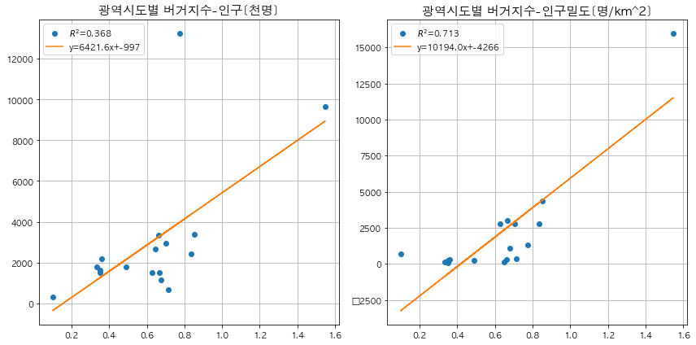
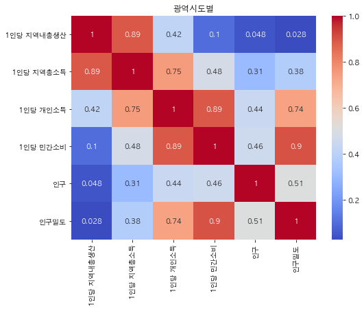

```python
import os
import numpy as np
import matplotlib.pyplot as plt
import pandas as pd

import seaborn as sns
import plotly
import cufflinks as cf
import plotly.express as px

# 오프라인 모드에서도 인터렉티브한 그래픽을 가능하도록 함
from plotly.offline import download_plotlyjs,init_notebook_mode, plot, iplot
init_notebook_mode(connected=True)
cf.go_offline()

# 한글 패치
from matplotlib import rc
rc('font', family='AppleGothic')

# 통계 분석
import scipy.stats

# ignore warnings
import warnings
warnings.filterwarnings(action='ignore')

```


<script type="text/javascript">
window.PlotlyConfig = {MathJaxConfig: 'local'};
if (window.MathJax) {MathJax.Hub.Config({SVG: {font: "STIX-Web"}});}
if (typeof require !== 'undefined') {
require.undef("plotly");
requirejs.config({
    paths: {
        'plotly': ['https://cdn.plot.ly/plotly-2.2.0.min']
    }
});
require(['plotly'], function(Plotly) {
    window._Plotly = Plotly;
});
}
</script>


<script type="text/javascript">
window.PlotlyConfig = {MathJaxConfig: 'local'};
if (window.MathJax) {MathJax.Hub.Config({SVG: {font: "STIX-Web"}});}
if (typeof require !== 'undefined') {
require.undef("plotly");
requirejs.config({
    paths: {
        'plotly': ['https://cdn.plot.ly/plotly-2.2.0.min']
    }
});
require(['plotly'], function(Plotly) {
    window._Plotly = Plotly;
});
}
</script>


```python
input_path = './input/'
output_path = './output/'
```


```python
# 데이터 로드
burger_df = pd.read_csv(input_path+'burger_df.csv')
nstore_df = pd.read_csv(input_path+'nstore_df.csv')
nstore_stat_df = pd.read_csv(input_path+'nstore_stat_df.csv')
final_df = pd.read_csv(input_path+'nstore_stat_df_2.csv')

burger_df.shape, nstore_df.shape, nstore_stat_df.shape, final_df.shape
```


    ((2306, 6), (224, 9), (17, 13), (224, 12))


```python
burger_df.head()
```


<div>
<style scoped>
    .dataframe tbody tr th:only-of-type {
        vertical-align: middle;
    }

    .dataframe tbody tr th {
        vertical-align: top;
    }

    .dataframe thead th {
        text-align: right;
    }
</style>
<table border="1" class="dataframe">
  <thead>
    <tr style="text-align: right;">
      <th></th>
      <th>지점명</th>
      <th>주소</th>
      <th>브랜드</th>
      <th>주소1</th>
      <th>주소2</th>
      <th>주소3</th>
    </tr>
  </thead>
  <tbody>
    <tr>
      <th>0</th>
      <td>선릉역점</td>
      <td>서울특별시 강남구 선릉로 429</td>
      <td>버거킹</td>
      <td>서울특별시</td>
      <td>강남구</td>
      <td>선릉로 429</td>
    </tr>
    <tr>
      <th>1</th>
      <td>대치역점</td>
      <td>서울특별시 강남구 남부순환로 2936</td>
      <td>버거킹</td>
      <td>서울특별시</td>
      <td>강남구</td>
      <td>남부순환로 2936</td>
    </tr>
    <tr>
      <th>2</th>
      <td>차병원사거리점</td>
      <td>서울특별시 강남구 봉은사로 179</td>
      <td>버거킹</td>
      <td>서울특별시</td>
      <td>강남구</td>
      <td>봉은사로 179</td>
    </tr>
    <tr>
      <th>3</th>
      <td>강남도곡점</td>
      <td>서울특별시 강남구 논현로 172 (도곡동 410-10) 1층</td>
      <td>버거킹</td>
      <td>서울특별시</td>
      <td>강남구</td>
      <td>논현로 172 (도곡동 410-10) 1층</td>
    </tr>
    <tr>
      <th>4</th>
      <td>청담점</td>
      <td>서울특별시 강남구 선릉로 812</td>
      <td>버거킹</td>
      <td>서울특별시</td>
      <td>강남구</td>
      <td>선릉로 812</td>
    </tr>
  </tbody>
</table>
</div>


```python
nstore_df.head()
```


<div>
<style scoped>
    .dataframe tbody tr th:only-of-type {
        vertical-align: middle;
    }

    .dataframe tbody tr th {
        vertical-align: top;
    }

    .dataframe thead th {
        text-align: right;
    }
</style>
<table border="1" class="dataframe">
  <thead>
    <tr style="text-align: right;">
      <th></th>
      <th>버거킹</th>
      <th>KFC</th>
      <th>맥도날드</th>
      <th>롯데리아</th>
      <th>BKM</th>
      <th>버거지수</th>
      <th>주소</th>
      <th>주소1</th>
      <th>주소2</th>
    </tr>
  </thead>
  <tbody>
    <tr>
      <th>0</th>
      <td>1</td>
      <td>0</td>
      <td>1</td>
      <td>6</td>
      <td>2</td>
      <td>0.333333</td>
      <td>강원도 강릉시</td>
      <td>강원도</td>
      <td>강릉시</td>
    </tr>
    <tr>
      <th>1</th>
      <td>1</td>
      <td>0</td>
      <td>1</td>
      <td>3</td>
      <td>2</td>
      <td>0.666667</td>
      <td>강원도 속초시</td>
      <td>강원도</td>
      <td>속초시</td>
    </tr>
    <tr>
      <th>2</th>
      <td>3</td>
      <td>1</td>
      <td>2</td>
      <td>15</td>
      <td>6</td>
      <td>0.400000</td>
      <td>강원도 원주시</td>
      <td>강원도</td>
      <td>원주시</td>
    </tr>
    <tr>
      <th>3</th>
      <td>2</td>
      <td>2</td>
      <td>2</td>
      <td>7</td>
      <td>6</td>
      <td>0.857143</td>
      <td>강원도 춘천시</td>
      <td>강원도</td>
      <td>춘천시</td>
    </tr>
    <tr>
      <th>4</th>
      <td>2</td>
      <td>0</td>
      <td>0</td>
      <td>2</td>
      <td>2</td>
      <td>1.000000</td>
      <td>강원도 홍천군</td>
      <td>강원도</td>
      <td>홍천군</td>
    </tr>
  </tbody>
</table>
</div>


```python
nstore_stat_df.head()
```


<div>
<style scoped>
    .dataframe tbody tr th:only-of-type {
        vertical-align: middle;
    }

    .dataframe tbody tr th {
        vertical-align: top;
    }

    .dataframe thead th {
        text-align: right;
    }
</style>
<table border="1" class="dataframe">
  <thead>
    <tr style="text-align: right;">
      <th></th>
      <th>버거킹</th>
      <th>KFC</th>
      <th>맥도날드</th>
      <th>롯데리아</th>
      <th>BKM</th>
      <th>버거지수</th>
      <th>시도별</th>
      <th>1인당 지역내총생산</th>
      <th>1인당 지역총소득</th>
      <th>1인당 개인소득</th>
      <th>1인당 민간소비</th>
      <th>인구</th>
      <th>인구밀도</th>
    </tr>
  </thead>
  <tbody>
    <tr>
      <th>0</th>
      <td>9</td>
      <td>3</td>
      <td>7</td>
      <td>54</td>
      <td>19</td>
      <td>0.351852</td>
      <td>강원도</td>
      <td>32061</td>
      <td>29392</td>
      <td>18997</td>
      <td>16811</td>
      <td>1521</td>
      <td>90</td>
    </tr>
    <tr>
      <th>1</th>
      <td>100</td>
      <td>50</td>
      <td>96</td>
      <td>317</td>
      <td>246</td>
      <td>0.776025</td>
      <td>경기도</td>
      <td>36133</td>
      <td>38466</td>
      <td>20482</td>
      <td>17399</td>
      <td>12786</td>
      <td>1255</td>
    </tr>
    <tr>
      <th>2</th>
      <td>24</td>
      <td>4</td>
      <td>29</td>
      <td>86</td>
      <td>57</td>
      <td>0.662791</td>
      <td>경상남도</td>
      <td>33690</td>
      <td>32140</td>
      <td>18939</td>
      <td>16426</td>
      <td>3339</td>
      <td>317</td>
    </tr>
    <tr>
      <th>3</th>
      <td>25</td>
      <td>4</td>
      <td>15</td>
      <td>68</td>
      <td>44</td>
      <td>0.647059</td>
      <td>경상북도</td>
      <td>40272</td>
      <td>34873</td>
      <td>18611</td>
      <td>16217</td>
      <td>2675</td>
      <td>141</td>
    </tr>
    <tr>
      <th>4</th>
      <td>15</td>
      <td>3</td>
      <td>10</td>
      <td>42</td>
      <td>28</td>
      <td>0.666667</td>
      <td>광주광역시</td>
      <td>27548</td>
      <td>30964</td>
      <td>20532</td>
      <td>18231</td>
      <td>1495</td>
      <td>2984</td>
    </tr>
  </tbody>
</table>
</div>


```python
final_df.head()
```


<div>
<style scoped>
    .dataframe tbody tr th:only-of-type {
        vertical-align: middle;
    }

    .dataframe tbody tr th {
        vertical-align: top;
    }

    .dataframe thead th {
        text-align: right;
    }
</style>
<table border="1" class="dataframe">
  <thead>
    <tr style="text-align: right;">
      <th></th>
      <th>버거킹</th>
      <th>KFC</th>
      <th>맥도날드</th>
      <th>롯데리아</th>
      <th>BKM</th>
      <th>버거지수</th>
      <th>주소</th>
      <th>주소1</th>
      <th>주소2</th>
      <th>인구수</th>
      <th>면적</th>
      <th>인구밀도</th>
    </tr>
  </thead>
  <tbody>
    <tr>
      <th>0</th>
      <td>1</td>
      <td>0</td>
      <td>1</td>
      <td>6</td>
      <td>2</td>
      <td>0.333333</td>
      <td>강원도 강릉시</td>
      <td>강원도</td>
      <td>강릉시</td>
      <td>213442</td>
      <td>1040.783864</td>
      <td>205.078122</td>
    </tr>
    <tr>
      <th>1</th>
      <td>1</td>
      <td>0</td>
      <td>1</td>
      <td>3</td>
      <td>2</td>
      <td>0.666667</td>
      <td>강원도 속초시</td>
      <td>강원도</td>
      <td>속초시</td>
      <td>81786</td>
      <td>105.760448</td>
      <td>773.313668</td>
    </tr>
    <tr>
      <th>2</th>
      <td>3</td>
      <td>1</td>
      <td>2</td>
      <td>15</td>
      <td>6</td>
      <td>0.400000</td>
      <td>강원도 원주시</td>
      <td>강원도</td>
      <td>원주시</td>
      <td>349215</td>
      <td>868.240238</td>
      <td>402.210108</td>
    </tr>
    <tr>
      <th>3</th>
      <td>2</td>
      <td>2</td>
      <td>2</td>
      <td>7</td>
      <td>6</td>
      <td>0.857143</td>
      <td>강원도 춘천시</td>
      <td>강원도</td>
      <td>춘천시</td>
      <td>281291</td>
      <td>1116.373900</td>
      <td>251.968449</td>
    </tr>
    <tr>
      <th>4</th>
      <td>2</td>
      <td>0</td>
      <td>0</td>
      <td>2</td>
      <td>2</td>
      <td>1.000000</td>
      <td>강원도 홍천군</td>
      <td>강원도</td>
      <td>홍천군</td>
      <td>69150</td>
      <td>1820.310462</td>
      <td>37.988025</td>
    </tr>
  </tbody>
</table>
</div>


# 광역시도별
## 1. 버거지수와 경제지표와의 상관관계


```python
x = nstore_stat_df["버거지수"]
col_label = ['1인당 지역내총생산', '1인당 지역총소득','1인당 개인소득', '1인당 민간소비']

fig, axes = plt.subplots(2,2, figsize=(12,10), sharex=True)

ncol = 0
for i in range(2):
    for j in range(2):
        ax = axes[i][j]
        y_label = col_label[ncol]
        y = np.array(nstore_stat_df[y_label].tolist())
        
        z = np.polyfit(x,y,1)
        f = np.poly1d(z)
        
        R = np.corrcoef(x, y)[0][1]
#         r = scipy.stats.pearsonr(x,y)[0]
#         print(abs(R-r)<1e-6)
        
        ax.plot(x, y,'o', label=r'$R^{2}$'+'={:.3f}'.format(R**2))
        ax.plot(x, f(x), label='y={:.1f}x+{:.0f}'.format(z[0],z[1]))
        ax.set_ylabel(y_label, fontsize=13)
        ax.grid(True)
        ax.legend(loc=4)

        ncol += 1

plt.suptitle("광역시도별 버거지수-경제지표 산점도", fontsize=18)
plt.tight_layout()
```


    

    


[comments] 
- 경제 지표별로 회귀선 차이가 꽤 난다. 
- 1인당 개인소득($R^{2}$=0.41) 또는 1인당 민간소비($R^{2}$=0.686) 지표가 버거지수가 약한 상관관계를 보이지만, 강하다고 말하기는 어렵다.

*그렇다면 인구수와 인구밀도와는 관계가 있을까?*

## 2 . 버거지수와 인구수, 인구밀도와의 상관관계


```python
x = nstore_stat_df["버거지수"]
col_label = ["인구", "인구밀도"]
col_scale = ["[천명]","[명/km^2]"]

fig, axes = plt.subplots(1,2, figsize=(12,6))

for i in range(2):
    ax = axes[i]
    y_label = col_label[i]
    y = nstore_stat_df[y_label]
    
    z = np.polyfit(x,y,1)
    f = np.poly1d(z)
    
    R = np.corrcoef(x,y)[0,1]
#     r = scipy.stats.pearsonr(x,y)[0]
#     print(abs(R-r)<1e-6)
    
    ax.plot(x, y,'o', label=r'$R^{2}$'+'={:.3f}'.format(R**2))
    ax.plot(x, f(x), label='y={:.1f}x+{:.0f}'.format(z[0],z[1]))
    ax.set_title("광역시도별 버거지수-"+y_label+col_scale[i], fontsize=15)
    ax.grid(True)
    ax.legend(loc=2)
    
plt.tight_layout()
```


    

    


[comments] 
- 인구수보다는 인구밀도가 버거지수에 더 설명력?있는 지표라고 말할 수 있겠다. 

*시구군별은 어떻게 될까? → 이 후에 확인*   

## 3. 브랜드별 매장수와 경제지표와의 상관관계


```python
x_labels = [ "버거킹", "KFC","맥도날드","롯데리아"]
y_labels = ['1인당 지역내총생산', '1인당 지역총소득','1인당 개인소득', '1인당 민간소비']

fig, axes = plt.subplots(4,4, figsize=(22,17))

for i in range(4):
    x_label = x_labels[i]
    x = nstore_stat_df[x_label]
    
    for j in range(4):
        ax = axes[i][j]
        y_label = y_labels[j]
        y = np.array(nstore_stat_df[y_label].tolist())
        
        z = np.polyfit(x,y,1)
        f = np.poly1d(z)
        
        R = np.corrcoef(x, y)[0][1]
        
        ax.plot(x, y,'o') #, label=y_label
        ax.plot(x, f(x), label=r'$R^{2}$'+'={:.3f}'.format(R**2))
        if j == 0 :
            ax.set_ylabel(x_label, fontsize=18)
        if i == 0 :
            ax.set_title(y_label, fontsize=18)
        ax.grid(True)
        ax.legend()


plt.suptitle("광역시도별", fontsize=20)
plt.tight_layout()
```


    

    


```python
# 광역시도별 버거지수 대비 인구수
px.scatter(nstore_stat_df, x='버거지수', y='인구', trendline='ols', hover_name='시도별')
```


<div>                            <div id="c5588e90-adcc-410d-a800-4d44d007d38e" class="plotly-graph-div" style="height:525px; width:100%;"></div>            <script type="text/javascript">                require(["plotly"], function(Plotly) {                    window.PLOTLYENV=window.PLOTLYENV || {};                                    if (document.getElementById("c5588e90-adcc-410d-a800-4d44d007d38e")) {                    Plotly.newPlot(                        "c5588e90-adcc-410d-a800-4d44d007d38e",                        [{"hovertemplate":"<b>%{hovertext}</b><br><br>\ubc84\uac70\uc9c0\uc218=%{x}<br>\uc778\uad6c=%{y}<extra></extra>","hovertext":["\uac15\uc6d0\ub3c4","\uacbd\uae30\ub3c4","\uacbd\uc0c1\ub0a8\ub3c4","\uacbd\uc0c1\ubd81\ub3c4","\uad11\uc8fc\uad11\uc5ed\uc2dc","\ub300\uad6c\uad11\uc5ed\uc2dc","\ub300\uc804\uad11\uc5ed\uc2dc","\ubd80\uc0b0\uad11\uc5ed\uc2dc","\uc11c\uc6b8\ud2b9\ubcc4\uc2dc","\uc138\uc885\ud2b9\ubcc4\uc790\uce58\uc2dc","\uc6b8\uc0b0\uad11\uc5ed\uc2dc","\uc778\ucc9c\uad11\uc5ed\uc2dc","\uc804\ub77c\ub0a8\ub3c4","\uc804\ub77c\ubd81\ub3c4","\uc81c\uc8fc\ud2b9\ubcc4\uc790\uce58\ub3c4","\ucda9\uccad\ub0a8\ub3c4","\ucda9\uccad\ubd81\ub3c4"],"legendgroup":"","marker":{"color":"#636efa","symbol":"circle"},"mode":"markers","name":"","orientation":"v","showlegend":false,"type":"scatter","x":[0.35185185185185186,0.7760252365930599,0.6627906976744186,0.6470588235294118,0.6666666666666666,0.8333333333333334,0.6274509803921569,0.8536585365853658,1.5469613259668509,0.1,0.6774193548387096,0.7027027027027027,0.3333333333333333,0.490566037735849,0.7142857142857143,0.3582089552238806,0.3508771929824561],"xaxis":"x","y":[1521,12786,3339,2675,1495,2458,1528,3424,9766,266,1159,2924,1795,1829,635,2153,1609],"yaxis":"y"},{"hovertemplate":"<b>OLS trendline</b><br>\uc778\uad6c = 6471.98 * \ubc84\uac70\uc9c0\uc218 + -1049.66<br>R<sup>2</sup>=0.389548<br><br>\ubc84\uac70\uc9c0\uc218=%{x}<br>\uc778\uad6c=%{y} <b>(trend)</b><extra></extra>","legendgroup":"","marker":{"color":"#636efa","symbol":"circle"},"mode":"lines","name":"","showlegend":false,"type":"scatter","x":[0.1,0.3333333333333333,0.3508771929824561,0.35185185185185186,0.3582089552238806,0.490566037735849,0.6274509803921569,0.6470588235294118,0.6627906976744186,0.6666666666666666,0.6774193548387096,0.7027027027027027,0.7142857142857143,0.7760252365930599,0.8333333333333334,0.8536585365853658,1.5469613259668509],"xaxis":"x","y":[-402.4571177336654,1107.672077498155,1221.2156260118259,1227.523600929252,1268.6666612115687,2125.2793519131283,3011.1962731685176,3138.0978862132088,3239.914296679297,3264.9994992578986,3334.590706411439,3498.2240853940884,3573.1891309378625,3972.766224377815,4343.663210137772,4475.207565123122,8962.250922468716],"yaxis":"y"}],                        {"legend":{"tracegroupgap":0},"margin":{"t":60},"template":{"data":{"bar":[{"error_x":{"color":"#2a3f5f"},"error_y":{"color":"#2a3f5f"},"marker":{"line":{"color":"#E5ECF6","width":0.5},"pattern":{"fillmode":"overlay","size":10,"solidity":0.2}},"type":"bar"}],"barpolar":[{"marker":{"line":{"color":"#E5ECF6","width":0.5},"pattern":{"fillmode":"overlay","size":10,"solidity":0.2}},"type":"barpolar"}],"carpet":[{"aaxis":{"endlinecolor":"#2a3f5f","gridcolor":"white","linecolor":"white","minorgridcolor":"white","startlinecolor":"#2a3f5f"},"baxis":{"endlinecolor":"#2a3f5f","gridcolor":"white","linecolor":"white","minorgridcolor":"white","startlinecolor":"#2a3f5f"},"type":"carpet"}],"choropleth":[{"colorbar":{"outlinewidth":0,"ticks":""},"type":"choropleth"}],"contour":[{"colorbar":{"outlinewidth":0,"ticks":""},"colorscale":[[0.0,"#0d0887"],[0.1111111111111111,"#46039f"],[0.2222222222222222,"#7201a8"],[0.3333333333333333,"#9c179e"],[0.4444444444444444,"#bd3786"],[0.5555555555555556,"#d8576b"],[0.6666666666666666,"#ed7953"],[0.7777777777777778,"#fb9f3a"],[0.8888888888888888,"#fdca26"],[1.0,"#f0f921"]],"type":"contour"}],"contourcarpet":[{"colorbar":{"outlinewidth":0,"ticks":""},"type":"contourcarpet"}],"heatmap":[{"colorbar":{"outlinewidth":0,"ticks":""},"colorscale":[[0.0,"#0d0887"],[0.1111111111111111,"#46039f"],[0.2222222222222222,"#7201a8"],[0.3333333333333333,"#9c179e"],[0.4444444444444444,"#bd3786"],[0.5555555555555556,"#d8576b"],[0.6666666666666666,"#ed7953"],[0.7777777777777778,"#fb9f3a"],[0.8888888888888888,"#fdca26"],[1.0,"#f0f921"]],"type":"heatmap"}],"heatmapgl":[{"colorbar":{"outlinewidth":0,"ticks":""},"colorscale":[[0.0,"#0d0887"],[0.1111111111111111,"#46039f"],[0.2222222222222222,"#7201a8"],[0.3333333333333333,"#9c179e"],[0.4444444444444444,"#bd3786"],[0.5555555555555556,"#d8576b"],[0.6666666666666666,"#ed7953"],[0.7777777777777778,"#fb9f3a"],[0.8888888888888888,"#fdca26"],[1.0,"#f0f921"]],"type":"heatmapgl"}],"histogram":[{"marker":{"pattern":{"fillmode":"overlay","size":10,"solidity":0.2}},"type":"histogram"}],"histogram2d":[{"colorbar":{"outlinewidth":0,"ticks":""},"colorscale":[[0.0,"#0d0887"],[0.1111111111111111,"#46039f"],[0.2222222222222222,"#7201a8"],[0.3333333333333333,"#9c179e"],[0.4444444444444444,"#bd3786"],[0.5555555555555556,"#d8576b"],[0.6666666666666666,"#ed7953"],[0.7777777777777778,"#fb9f3a"],[0.8888888888888888,"#fdca26"],[1.0,"#f0f921"]],"type":"histogram2d"}],"histogram2dcontour":[{"colorbar":{"outlinewidth":0,"ticks":""},"colorscale":[[0.0,"#0d0887"],[0.1111111111111111,"#46039f"],[0.2222222222222222,"#7201a8"],[0.3333333333333333,"#9c179e"],[0.4444444444444444,"#bd3786"],[0.5555555555555556,"#d8576b"],[0.6666666666666666,"#ed7953"],[0.7777777777777778,"#fb9f3a"],[0.8888888888888888,"#fdca26"],[1.0,"#f0f921"]],"type":"histogram2dcontour"}],"mesh3d":[{"colorbar":{"outlinewidth":0,"ticks":""},"type":"mesh3d"}],"parcoords":[{"line":{"colorbar":{"outlinewidth":0,"ticks":""}},"type":"parcoords"}],"pie":[{"automargin":true,"type":"pie"}],"scatter":[{"marker":{"colorbar":{"outlinewidth":0,"ticks":""}},"type":"scatter"}],"scatter3d":[{"line":{"colorbar":{"outlinewidth":0,"ticks":""}},"marker":{"colorbar":{"outlinewidth":0,"ticks":""}},"type":"scatter3d"}],"scattercarpet":[{"marker":{"colorbar":{"outlinewidth":0,"ticks":""}},"type":"scattercarpet"}],"scattergeo":[{"marker":{"colorbar":{"outlinewidth":0,"ticks":""}},"type":"scattergeo"}],"scattergl":[{"marker":{"colorbar":{"outlinewidth":0,"ticks":""}},"type":"scattergl"}],"scattermapbox":[{"marker":{"colorbar":{"outlinewidth":0,"ticks":""}},"type":"scattermapbox"}],"scatterpolar":[{"marker":{"colorbar":{"outlinewidth":0,"ticks":""}},"type":"scatterpolar"}],"scatterpolargl":[{"marker":{"colorbar":{"outlinewidth":0,"ticks":""}},"type":"scatterpolargl"}],"scatterternary":[{"marker":{"colorbar":{"outlinewidth":0,"ticks":""}},"type":"scatterternary"}],"surface":[{"colorbar":{"outlinewidth":0,"ticks":""},"colorscale":[[0.0,"#0d0887"],[0.1111111111111111,"#46039f"],[0.2222222222222222,"#7201a8"],[0.3333333333333333,"#9c179e"],[0.4444444444444444,"#bd3786"],[0.5555555555555556,"#d8576b"],[0.6666666666666666,"#ed7953"],[0.7777777777777778,"#fb9f3a"],[0.8888888888888888,"#fdca26"],[1.0,"#f0f921"]],"type":"surface"}],"table":[{"cells":{"fill":{"color":"#EBF0F8"},"line":{"color":"white"}},"header":{"fill":{"color":"#C8D4E3"},"line":{"color":"white"}},"type":"table"}]},"layout":{"annotationdefaults":{"arrowcolor":"#2a3f5f","arrowhead":0,"arrowwidth":1},"autotypenumbers":"strict","coloraxis":{"colorbar":{"outlinewidth":0,"ticks":""}},"colorscale":{"diverging":[[0,"#8e0152"],[0.1,"#c51b7d"],[0.2,"#de77ae"],[0.3,"#f1b6da"],[0.4,"#fde0ef"],[0.5,"#f7f7f7"],[0.6,"#e6f5d0"],[0.7,"#b8e186"],[0.8,"#7fbc41"],[0.9,"#4d9221"],[1,"#276419"]],"sequential":[[0.0,"#0d0887"],[0.1111111111111111,"#46039f"],[0.2222222222222222,"#7201a8"],[0.3333333333333333,"#9c179e"],[0.4444444444444444,"#bd3786"],[0.5555555555555556,"#d8576b"],[0.6666666666666666,"#ed7953"],[0.7777777777777778,"#fb9f3a"],[0.8888888888888888,"#fdca26"],[1.0,"#f0f921"]],"sequentialminus":[[0.0,"#0d0887"],[0.1111111111111111,"#46039f"],[0.2222222222222222,"#7201a8"],[0.3333333333333333,"#9c179e"],[0.4444444444444444,"#bd3786"],[0.5555555555555556,"#d8576b"],[0.6666666666666666,"#ed7953"],[0.7777777777777778,"#fb9f3a"],[0.8888888888888888,"#fdca26"],[1.0,"#f0f921"]]},"colorway":["#636efa","#EF553B","#00cc96","#ab63fa","#FFA15A","#19d3f3","#FF6692","#B6E880","#FF97FF","#FECB52"],"font":{"color":"#2a3f5f"},"geo":{"bgcolor":"white","lakecolor":"white","landcolor":"#E5ECF6","showlakes":true,"showland":true,"subunitcolor":"white"},"hoverlabel":{"align":"left"},"hovermode":"closest","mapbox":{"style":"light"},"paper_bgcolor":"white","plot_bgcolor":"#E5ECF6","polar":{"angularaxis":{"gridcolor":"white","linecolor":"white","ticks":""},"bgcolor":"#E5ECF6","radialaxis":{"gridcolor":"white","linecolor":"white","ticks":""}},"scene":{"xaxis":{"backgroundcolor":"#E5ECF6","gridcolor":"white","gridwidth":2,"linecolor":"white","showbackground":true,"ticks":"","zerolinecolor":"white"},"yaxis":{"backgroundcolor":"#E5ECF6","gridcolor":"white","gridwidth":2,"linecolor":"white","showbackground":true,"ticks":"","zerolinecolor":"white"},"zaxis":{"backgroundcolor":"#E5ECF6","gridcolor":"white","gridwidth":2,"linecolor":"white","showbackground":true,"ticks":"","zerolinecolor":"white"}},"shapedefaults":{"line":{"color":"#2a3f5f"}},"ternary":{"aaxis":{"gridcolor":"white","linecolor":"white","ticks":""},"baxis":{"gridcolor":"white","linecolor":"white","ticks":""},"bgcolor":"#E5ECF6","caxis":{"gridcolor":"white","linecolor":"white","ticks":""}},"title":{"x":0.05},"xaxis":{"automargin":true,"gridcolor":"white","linecolor":"white","ticks":"","title":{"standoff":15},"zerolinecolor":"white","zerolinewidth":2},"yaxis":{"automargin":true,"gridcolor":"white","linecolor":"white","ticks":"","title":{"standoff":15},"zerolinecolor":"white","zerolinewidth":2}}},"xaxis":{"anchor":"y","domain":[0.0,1.0],"title":{"text":"\ubc84\uac70\uc9c0\uc218"}},"yaxis":{"anchor":"x","domain":[0.0,1.0],"title":{"text":"\uc778\uad6c"}}},                        {"responsive": true}                    ).then(function(){

var gd = document.getElementById('c5588e90-adcc-410d-a800-4d44d007d38e');
var x = new MutationObserver(function (mutations, observer) {{
        var display = window.getComputedStyle(gd).display;
        if (!display || display === 'none') {{
            console.log([gd, 'removed!']);
            Plotly.purge(gd);
            observer.disconnect();
        }}
}});

// Listen for the removal of the full notebook cells
var notebookContainer = gd.closest('#notebook-container');
if (notebookContainer) {{
    x.observe(notebookContainer, {childList: true});
}}

// Listen for the clearing of the current output cell
var outputEl = gd.closest('.output');
if (outputEl) {{
    x.observe(outputEl, {childList: true});
}}

                        })                };                });            </script>        </div>


### heatmap 그리기


```python
# all_correlation
plt.figure(figsize=(15,15))
sns.heatmap(nstore_stat_df.corr(), annot=True)
plt.show()
```


    

    


```python
# 버거 브랜드 - 경제 지표 및 인구의 상관관계
R_df = nstore_stat_df.corr().iloc[:6, 6:]
fig = plt.figure(figsize=(8,6))
sns.heatmap(R_df.T, annot=True, cmap='coolwarm')
plt.title("광역시도별")
plt.show()

fig.savefig(output_path+"burger-eco-heatmap.png")
```


    

    


```python
# 버거 브랜드끼리의 상관관계
bidx_df = nstore_stat_df.corr().iloc[:6,:6]
plt.figure(figsize=(8,6))
sns.heatmap(bidx_df, annot=True, cmap='coolwarm')
plt.title("광역시도별")
plt.show()
```


    

    


```python
# 경제 지표 및 인구끼리의 상관관계
idx_df = nstore_stat_df.corr().iloc[6:,6:]
plt.figure(figsize=(8,6))
sns.heatmap(idx_df, annot=True, cmap='coolwarm')
plt.title("광역시도별")
plt.show()
```


    

    


```python

```


```python
final_df.head()
```


<div>
<style scoped>
    .dataframe tbody tr th:only-of-type {
        vertical-align: middle;
    }

    .dataframe tbody tr th {
        vertical-align: top;
    }

    .dataframe thead th {
        text-align: right;
    }
</style>
<table border="1" class="dataframe">
  <thead>
    <tr style="text-align: right;">
      <th></th>
      <th>버거킹</th>
      <th>KFC</th>
      <th>맥도날드</th>
      <th>롯데리아</th>
      <th>BKM</th>
      <th>버거지수</th>
      <th>주소</th>
      <th>주소1</th>
      <th>주소2</th>
      <th>인구수</th>
      <th>면적</th>
      <th>인구밀도</th>
    </tr>
  </thead>
  <tbody>
    <tr>
      <th>0</th>
      <td>1</td>
      <td>0</td>
      <td>1</td>
      <td>6</td>
      <td>2</td>
      <td>0.333333</td>
      <td>강원도 강릉시</td>
      <td>강원도</td>
      <td>강릉시</td>
      <td>213442</td>
      <td>1040.783864</td>
      <td>205.078122</td>
    </tr>
    <tr>
      <th>1</th>
      <td>1</td>
      <td>0</td>
      <td>1</td>
      <td>3</td>
      <td>2</td>
      <td>0.666667</td>
      <td>강원도 속초시</td>
      <td>강원도</td>
      <td>속초시</td>
      <td>81786</td>
      <td>105.760448</td>
      <td>773.313668</td>
    </tr>
    <tr>
      <th>2</th>
      <td>3</td>
      <td>1</td>
      <td>2</td>
      <td>15</td>
      <td>6</td>
      <td>0.400000</td>
      <td>강원도 원주시</td>
      <td>강원도</td>
      <td>원주시</td>
      <td>349215</td>
      <td>868.240238</td>
      <td>402.210108</td>
    </tr>
    <tr>
      <th>3</th>
      <td>2</td>
      <td>2</td>
      <td>2</td>
      <td>7</td>
      <td>6</td>
      <td>0.857143</td>
      <td>강원도 춘천시</td>
      <td>강원도</td>
      <td>춘천시</td>
      <td>281291</td>
      <td>1116.373900</td>
      <td>251.968449</td>
    </tr>
    <tr>
      <th>4</th>
      <td>2</td>
      <td>0</td>
      <td>0</td>
      <td>2</td>
      <td>2</td>
      <td>1.000000</td>
      <td>강원도 홍천군</td>
      <td>강원도</td>
      <td>홍천군</td>
      <td>69150</td>
      <td>1820.310462</td>
      <td>37.988025</td>
    </tr>
  </tbody>
</table>
</div>


# 시군구별
## 1. 버거지수와 인구수, 인구밀도의 상관관계


```python
x = final_df["버거지수"]
col_label = ["인구수", "인구밀도"]
col_scale = ["[천명]","[명/km^2]"]

fig, axes = plt.subplots(1,2, figsize=(12,6))

for i in range(2):
    ax = axes[i]
    y_label = col_label[i]
    y = final_df[y_label]
    
    z = np.polyfit(x,y,1)
    f = np.poly1d(z)
    
    R = np.corrcoef(x,y)[0,1]
#     r = scipy.stats.pearsonr(x,y)[0]
#     print(abs(R-r)<1e-6)
    
    ax.plot(x, y,'o', label=r'$R^{2}$'+'={:.3f}'.format(R**2))
    ax.plot(x, f(x), label='y={:.1f}x+{:.0f}'.format(z[0],z[1]))
    ax.set_title("시군구별 버거지수-"+y_label+col_scale[i], fontsize=15)
    ax.grid(True)
    ax.legend(loc=2)
    
plt.tight_layout()
```


    

    


```python
# 버거지수에 따른 인구밀도
px.scatter(final_df, x='버거지수', y='인구밀도', trendline='ols', hover_name='주소')
```


<div>                            <div id="55c56648-f5f9-4a1c-ae35-aa5a621b1d4b" class="plotly-graph-div" style="height:525px; width:100%;"></div>            <script type="text/javascript">                require(["plotly"], function(Plotly) {                    window.PLOTLYENV=window.PLOTLYENV || {};                                    if (document.getElementById("55c56648-f5f9-4a1c-ae35-aa5a621b1d4b")) {                    Plotly.newPlot(                        "55c56648-f5f9-4a1c-ae35-aa5a621b1d4b",                        [{"hovertemplate":"<b>%{hovertext}</b><br><br>\ubc84\uac70\uc9c0\uc218=%{x}<br>\uc778\uad6c\ubc00\ub3c4=%{y}<extra></extra>","hovertext":["\uac15\uc6d0\ub3c4 \uac15\ub989\uc2dc","\uac15\uc6d0\ub3c4 \uc18d\ucd08\uc2dc","\uac15\uc6d0\ub3c4 \uc6d0\uc8fc\uc2dc","\uac15\uc6d0\ub3c4 \ucd98\ucc9c\uc2dc","\uac15\uc6d0\ub3c4 \ud64d\ucc9c\uad70","\uacbd\uae30\ub3c4 \uace0\uc591\uc2dc","\uacbd\uae30\ub3c4 \uacfc\ucc9c\uc2dc","\uacbd\uae30\ub3c4 \uad11\uba85\uc2dc","\uacbd\uae30\ub3c4 \uad11\uc8fc\uc2dc","\uacbd\uae30\ub3c4 \uad6c\ub9ac\uc2dc","\uacbd\uae30\ub3c4 \uad70\ud3ec\uc2dc","\uacbd\uae30\ub3c4 \uae40\ud3ec\uc2dc","\uacbd\uae30\ub3c4 \ub0a8\uc591\uc8fc\uc2dc","\uacbd\uae30\ub3c4 \ub3d9\ub450\ucc9c\uc2dc","\uacbd\uae30\ub3c4 \ubd80\ucc9c\uc2dc","\uacbd\uae30\ub3c4 \uc131\ub0a8\uc2dc","\uacbd\uae30\ub3c4 \uc218\uc6d0\uc2dc","\uacbd\uae30\ub3c4 \uc2dc\ud765\uc2dc","\uacbd\uae30\ub3c4 \uc548\uc0b0\uc2dc","\uacbd\uae30\ub3c4 \uc548\uc131\uc2dc","\uacbd\uae30\ub3c4 \uc548\uc591\uc2dc","\uacbd\uae30\ub3c4 \uc591\uc8fc\uc2dc","\uacbd\uae30\ub3c4 \uc591\ud3c9\uad70","\uacbd\uae30\ub3c4 \uc624\uc0b0\uc2dc","\uacbd\uae30\ub3c4 \uc6a9\uc778\uc2dc","\uacbd\uae30\ub3c4 \uc758\uc815\ubd80\uc2dc","\uacbd\uae30\ub3c4 \uc774\ucc9c\uc2dc","\uacbd\uae30\ub3c4 \ud30c\uc8fc\uc2dc","\uacbd\uae30\ub3c4 \ud3c9\ud0dd\uc2dc","\uacbd\uae30\ub3c4 \ud3ec\ucc9c\uc2dc","\uacbd\uae30\ub3c4 \ud558\ub0a8\uc2dc","\uacbd\uae30\ub3c4 \ud654\uc131\uc2dc","\uacbd\uc0c1\ub0a8\ub3c4 \uac70\uc81c\uc2dc","\uacbd\uc0c1\ub0a8\ub3c4 \uae40\ud574\uc2dc","\uacbd\uc0c1\ub0a8\ub3c4 \uc0ac\ucc9c\uc2dc","\uacbd\uc0c1\ub0a8\ub3c4 \uc591\uc0b0\uc2dc","\uacbd\uc0c1\ub0a8\ub3c4 \uc9c4\uc8fc\uc2dc","\uacbd\uc0c1\ub0a8\ub3c4 \ucc3d\uc6d0\uc2dc","\uacbd\uc0c1\ubd81\ub3c4 \uacbd\uc0b0\uc2dc","\uacbd\uc0c1\ubd81\ub3c4 \uacbd\uc8fc\uc2dc","\uacbd\uc0c1\ubd81\ub3c4 \uad6c\ubbf8\uc2dc","\uacbd\uc0c1\ubd81\ub3c4 \uae40\ucc9c\uc2dc","\uacbd\uc0c1\ubd81\ub3c4 \uc0c1\uc8fc\uc2dc","\uacbd\uc0c1\ubd81\ub3c4 \uc548\ub3d9\uc2dc","\uacbd\uc0c1\ubd81\ub3c4 \uc601\uc8fc\uc2dc","\uacbd\uc0c1\ubd81\ub3c4 \ud3ec\ud56d\uc2dc","\uad11\uc8fc\uad11\uc5ed\uc2dc \uad11\uc0b0\uad6c","\uad11\uc8fc\uad11\uc5ed\uc2dc \ub0a8\uad6c","\uad11\uc8fc\uad11\uc5ed\uc2dc \ub3d9\uad6c","\uad11\uc8fc\uad11\uc5ed\uc2dc \ubd81\uad6c","\uad11\uc8fc\uad11\uc5ed\uc2dc \uc11c\uad6c","\ub300\uad6c\uad11\uc5ed\uc2dc \ub0a8\uad6c","\ub300\uad6c\uad11\uc5ed\uc2dc \ub2ec\uc11c\uad6c","\ub300\uad6c\uad11\uc5ed\uc2dc \ub2ec\uc131\uad70","\ub300\uad6c\uad11\uc5ed\uc2dc \ub3d9\uad6c","\ub300\uad6c\uad11\uc5ed\uc2dc \ubd81\uad6c","\ub300\uad6c\uad11\uc5ed\uc2dc \uc11c\uad6c","\ub300\uad6c\uad11\uc5ed\uc2dc \uc218\uc131\uad6c","\ub300\uad6c\uad11\uc5ed\uc2dc \uc911\uad6c","\ub300\uc804\uad11\uc5ed\uc2dc \ub3d9\uad6c","\ub300\uc804\uad11\uc5ed\uc2dc \uc11c\uad6c","\ub300\uc804\uad11\uc5ed\uc2dc \uc720\uc131\uad6c","\ub300\uc804\uad11\uc5ed\uc2dc \uc911\uad6c","\ubd80\uc0b0\uad11\uc5ed\uc2dc \uae08\uc815\uad6c","\ubd80\uc0b0\uad11\uc5ed\uc2dc \uae30\uc7a5\uad70","\ubd80\uc0b0\uad11\uc5ed\uc2dc \ub0a8\uad6c","\ubd80\uc0b0\uad11\uc5ed\uc2dc \ub3d9\ub798\uad6c","\ubd80\uc0b0\uad11\uc5ed\uc2dc \ubd80\uc0b0\uc9c4\uad6c","\ubd80\uc0b0\uad11\uc5ed\uc2dc \ubd81\uad6c","\ubd80\uc0b0\uad11\uc5ed\uc2dc \uc0ac\uc0c1\uad6c","\ubd80\uc0b0\uad11\uc5ed\uc2dc \uc0ac\ud558\uad6c","\ubd80\uc0b0\uad11\uc5ed\uc2dc \uc5f0\uc81c\uad6c","\ubd80\uc0b0\uad11\uc5ed\uc2dc \ud574\uc6b4\ub300\uad6c","\uc11c\uc6b8\ud2b9\ubcc4\uc2dc \uac15\ub0a8\uad6c","\uc11c\uc6b8\ud2b9\ubcc4\uc2dc \uac15\ub3d9\uad6c","\uc11c\uc6b8\ud2b9\ubcc4\uc2dc \uac15\ubd81\uad6c","\uc11c\uc6b8\ud2b9\ubcc4\uc2dc \uac15\uc11c\uad6c","\uc11c\uc6b8\ud2b9\ubcc4\uc2dc \uad00\uc545\uad6c","\uc11c\uc6b8\ud2b9\ubcc4\uc2dc \uad11\uc9c4\uad6c","\uc11c\uc6b8\ud2b9\ubcc4\uc2dc \uad6c\ub85c\uad6c","\uc11c\uc6b8\ud2b9\ubcc4\uc2dc \uae08\ucc9c\uad6c","\uc11c\uc6b8\ud2b9\ubcc4\uc2dc \ub178\uc6d0\uad6c","\uc11c\uc6b8\ud2b9\ubcc4\uc2dc \ub3c4\ubd09\uad6c","\uc11c\uc6b8\ud2b9\ubcc4\uc2dc \ub3d9\ub300\ubb38\uad6c","\uc11c\uc6b8\ud2b9\ubcc4\uc2dc \ub3d9\uc791\uad6c","\uc11c\uc6b8\ud2b9\ubcc4\uc2dc \ub9c8\ud3ec\uad6c","\uc11c\uc6b8\ud2b9\ubcc4\uc2dc \uc11c\ub300\ubb38\uad6c","\uc11c\uc6b8\ud2b9\ubcc4\uc2dc \uc11c\ucd08\uad6c","\uc11c\uc6b8\ud2b9\ubcc4\uc2dc \uc131\ub3d9\uad6c","\uc11c\uc6b8\ud2b9\ubcc4\uc2dc \uc131\ubd81\uad6c","\uc11c\uc6b8\ud2b9\ubcc4\uc2dc \uc1a1\ud30c\uad6c","\uc11c\uc6b8\ud2b9\ubcc4\uc2dc \uc591\ucc9c\uad6c","\uc11c\uc6b8\ud2b9\ubcc4\uc2dc \uc601\ub4f1\ud3ec\uad6c","\uc11c\uc6b8\ud2b9\ubcc4\uc2dc \uc6a9\uc0b0\uad6c","\uc11c\uc6b8\ud2b9\ubcc4\uc2dc \uc740\ud3c9\uad6c","\uc11c\uc6b8\ud2b9\ubcc4\uc2dc \uc885\ub85c\uad6c","\uc11c\uc6b8\ud2b9\ubcc4\uc2dc \uc911\uad6c","\uc11c\uc6b8\ud2b9\ubcc4\uc2dc \uc911\ub791\uad6c","\uc6b8\uc0b0\uad11\uc5ed\uc2dc \ub0a8\uad6c","\uc6b8\uc0b0\uad11\uc5ed\uc2dc \ub3d9\uad6c","\uc6b8\uc0b0\uad11\uc5ed\uc2dc \ubd81\uad6c","\uc6b8\uc0b0\uad11\uc5ed\uc2dc \uc911\uad6c","\uc778\ucc9c\uad11\uc5ed\uc2dc \uacc4\uc591\uad6c","\uc778\ucc9c\uad11\uc5ed\uc2dc \ub0a8\ub3d9\uad6c","\uc778\ucc9c\uad11\uc5ed\uc2dc \ubbf8\ucd94\ud640\uad6c","\uc778\ucc9c\uad11\uc5ed\uc2dc \ubd80\ud3c9\uad6c","\uc778\ucc9c\uad11\uc5ed\uc2dc \uc11c\uad6c","\uc778\ucc9c\uad11\uc5ed\uc2dc \uc5f0\uc218\uad6c","\uc778\ucc9c\uad11\uc5ed\uc2dc \uc911\uad6c","\uc804\ub77c\ub0a8\ub3c4 \uad11\uc591\uc2dc","\uc804\ub77c\ub0a8\ub3c4 \ub098\uc8fc\uc2dc","\uc804\ub77c\ub0a8\ub3c4 \ubaa9\ud3ec\uc2dc","\uc804\ub77c\ub0a8\ub3c4 \ubb34\uc548\uad70","\uc804\ub77c\ub0a8\ub3c4 \uc21c\ucc9c\uc2dc","\uc804\ub77c\ub0a8\ub3c4 \uc5ec\uc218\uc2dc","\uc804\ub77c\ubd81\ub3c4 \uad70\uc0b0\uc2dc","\uc804\ub77c\ubd81\ub3c4 \uc775\uc0b0\uc2dc","\uc804\ub77c\ubd81\ub3c4 \uc804\uc8fc\uc2dc","\uc804\ub77c\ubd81\ub3c4 \uc815\uc74d\uc2dc","\uc81c\uc8fc\ud2b9\ubcc4\uc790\uce58\ub3c4 \uc81c\uc8fc\uc2dc","\ucda9\uccad\ub0a8\ub3c4 \ub2f9\uc9c4\uc2dc","\ucda9\uccad\ub0a8\ub3c4 \ubcf4\ub839\uc2dc","\ucda9\uccad\ub0a8\ub3c4 \uc11c\uc0b0\uc2dc","\ucda9\uccad\ub0a8\ub3c4 \ucc9c\uc548\uc2dc","\ucda9\uccad\ub0a8\ub3c4 \ud64d\uc131\uad70","\ucda9\uccad\ubd81\ub3c4 \uc74c\uc131\uad70","\ucda9\uccad\ubd81\ub3c4 \uc9c4\ucc9c\uad70","\ucda9\uccad\ubd81\ub3c4 \uccad\uc8fc\uc2dc","\ucda9\uccad\ubd81\ub3c4 \ucda9\uc8fc\uc2dc","\uc138\uc885\ud2b9\ubcc4\uc790\uce58\uc2dc \uc138\uc885\ud2b9\ubcc4\uc790\uce58\uc2dc","\uc81c\uc8fc\ud2b9\ubcc4\uc790\uce58\ub3c4 \uc11c\uadc0\ud3ec\uc2dc","\ucda9\uccad\ub0a8\ub3c4 \uc544\uc0b0\uc2dc","\uac15\uc6d0\ub3c4 \ub3d9\ud574\uc2dc","\uacbd\uae30\ub3c4 \uc758\uc655\uc2dc","\uacbd\uc0c1\ub0a8\ub3c4 \ubc00\uc591\uc2dc","\uacbd\uc0c1\ub0a8\ub3c4 \ud1b5\uc601\uc2dc","\uacbd\uc0c1\ubd81\ub3c4 \uc601\ucc9c\uc2dc","\ub300\uc804\uad11\uc5ed\uc2dc \ub300\ub355\uad6c","\ubd80\uc0b0\uad11\uc5ed\uc2dc \uac15\uc11c\uad6c","\ubd80\uc0b0\uad11\uc5ed\uc2dc \ub3d9\uad6c","\ubd80\uc0b0\uad11\uc5ed\uc2dc \uc218\uc601\uad6c","\ubd80\uc0b0\uad11\uc5ed\uc2dc \uc601\ub3c4\uad6c","\uc6b8\uc0b0\uad11\uc5ed\uc2dc \uc6b8\uc8fc\uad70","\ucda9\uccad\ub0a8\ub3c4 \ub17c\uc0b0\uc2dc","\ucda9\uccad\ubd81\ub3c4 \uc81c\ucc9c\uc2dc","\uac15\uc6d0\ub3c4 \uace0\uc131\uad70","\uac15\uc6d0\ub3c4 \uc0bc\ucc99\uc2dc","\uac15\uc6d0\ub3c4 \uc591\uad6c\uad70","\uac15\uc6d0\ub3c4 \uc591\uc591\uad70","\uac15\uc6d0\ub3c4 \uc601\uc6d4\uad70","\uac15\uc6d0\ub3c4 \uc778\uc81c\uad70","\uac15\uc6d0\ub3c4 \uc815\uc120\uad70","\uac15\uc6d0\ub3c4 \ucca0\uc6d0\uad70","\uac15\uc6d0\ub3c4 \ud0dc\ubc31\uc2dc","\uac15\uc6d0\ub3c4 \ud3c9\ucc3d\uad70","\uac15\uc6d0\ub3c4 \ud654\ucc9c\uad70","\uac15\uc6d0\ub3c4 \ud6a1\uc131\uad70","\uacbd\uae30\ub3c4 \uac00\ud3c9\uad70","\uacbd\uae30\ub3c4 \uc5ec\uc8fc\uc2dc","\uacbd\uae30\ub3c4 \uc5f0\ucc9c\uad70","\uacbd\uc0c1\ub0a8\ub3c4 \uac70\ucc3d\uad70","\uacbd\uc0c1\ub0a8\ub3c4 \uace0\uc131\uad70","\uacbd\uc0c1\ub0a8\ub3c4 \ub0a8\ud574\uad70","\uacbd\uc0c1\ub0a8\ub3c4 \uc0b0\uccad\uad70","\uacbd\uc0c1\ub0a8\ub3c4 \uc758\ub839\uad70","\uacbd\uc0c1\ub0a8\ub3c4 \ucc3d\ub155\uad70","\uacbd\uc0c1\ub0a8\ub3c4 \ud558\ub3d9\uad70","\uacbd\uc0c1\ub0a8\ub3c4 \ud568\uc548\uad70","\uacbd\uc0c1\ub0a8\ub3c4 \ud568\uc591\uad70","\uacbd\uc0c1\ub0a8\ub3c4 \ud569\ucc9c\uad70","\uacbd\uc0c1\ubd81\ub3c4 \uace0\ub839\uad70","\uacbd\uc0c1\ubd81\ub3c4 \ubb38\uacbd\uc2dc","\uacbd\uc0c1\ubd81\ub3c4 \ubd09\ud654\uad70","\uacbd\uc0c1\ubd81\ub3c4 \uc131\uc8fc\uad70","\uacbd\uc0c1\ubd81\ub3c4 \uc601\ub355\uad70","\uacbd\uc0c1\ubd81\ub3c4 \uc608\ucc9c\uad70","\uacbd\uc0c1\ubd81\ub3c4 \uc6b8\ub989\uad70","\uacbd\uc0c1\ubd81\ub3c4 \uc6b8\uc9c4\uad70","\uacbd\uc0c1\ubd81\ub3c4 \uc758\uc131\uad70","\uacbd\uc0c1\ubd81\ub3c4 \uccad\ub3c4\uad70","\uacbd\uc0c1\ubd81\ub3c4 \uce60\uace1\uad70","\ubd80\uc0b0\uad11\uc5ed\uc2dc \uc11c\uad6c","\ubd80\uc0b0\uad11\uc5ed\uc2dc \uc911\uad6c","\uc778\ucc9c\uad11\uc5ed\uc2dc \uac15\ud654\uad70","\uc778\ucc9c\uad11\uc5ed\uc2dc \uc639\uc9c4\uad70","\uc804\ub77c\ub0a8\ub3c4 \uac15\uc9c4\uad70","\uc804\ub77c\ub0a8\ub3c4 \uace0\ud765\uad70","\uc804\ub77c\ub0a8\ub3c4 \uace1\uc131\uad70","\uc804\ub77c\ub0a8\ub3c4 \uad6c\ub840\uad70","\uc804\ub77c\ub0a8\ub3c4 \ub2f4\uc591\uad70","\uc804\ub77c\ub0a8\ub3c4 \ubcf4\uc131\uad70","\uc804\ub77c\ub0a8\ub3c4 \uc601\uad11\uad70","\uc804\ub77c\ub0a8\ub3c4 \uc601\uc554\uad70","\uc804\ub77c\ub0a8\ub3c4 \uc644\ub3c4\uad70","\uc804\ub77c\ub0a8\ub3c4 \uc7a5\uc131\uad70","\uc804\ub77c\ub0a8\ub3c4 \uc7a5\ud765\uad70","\uc804\ub77c\ub0a8\ub3c4 \uc9c4\ub3c4\uad70","\uc804\ub77c\ub0a8\ub3c4 \ud568\ud3c9\uad70","\uc804\ub77c\ub0a8\ub3c4 \ud574\ub0a8\uad70","\uc804\ub77c\ub0a8\ub3c4 \ud654\uc21c\uad70","\uc804\ub77c\ubd81\ub3c4 \uace0\ucc3d\uad70","\uc804\ub77c\ubd81\ub3c4 \uae40\uc81c\uc2dc","\uc804\ub77c\ubd81\ub3c4 \ub0a8\uc6d0\uc2dc","\uc804\ub77c\ubd81\ub3c4 \ubb34\uc8fc\uad70","\uc804\ub77c\ubd81\ub3c4 \ubd80\uc548\uad70","\uc804\ub77c\ubd81\ub3c4 \uc21c\ucc3d\uad70","\uc804\ub77c\ubd81\ub3c4 \uc644\uc8fc\uad70","\uc804\ub77c\ubd81\ub3c4 \uc784\uc2e4\uad70","\uc804\ub77c\ubd81\ub3c4 \uc7a5\uc218\uad70","\uc804\ub77c\ubd81\ub3c4 \uc9c4\uc548\uad70","\ucda9\uccad\ub0a8\ub3c4 \uacc4\ub8e1\uc2dc","\ucda9\uccad\ub0a8\ub3c4 \uacf5\uc8fc\uc2dc","\ucda9\uccad\ub0a8\ub3c4 \uae08\uc0b0\uad70","\ucda9\uccad\ub0a8\ub3c4 \ubd80\uc5ec\uad70","\ucda9\uccad\ub0a8\ub3c4 \uc11c\ucc9c\uad70","\ucda9\uccad\ub0a8\ub3c4 \uc608\uc0b0\uad70","\ucda9\uccad\ub0a8\ub3c4 \uccad\uc591\uad70","\ucda9\uccad\ub0a8\ub3c4 \ud0dc\uc548\uad70","\ucda9\uccad\ubd81\ub3c4 \uad34\uc0b0\uad70","\ucda9\uccad\ubd81\ub3c4 \ub2e8\uc591\uad70","\ucda9\uccad\ubd81\ub3c4 \ubcf4\uc740\uad70","\ucda9\uccad\ubd81\ub3c4 \uc601\ub3d9\uad70","\ucda9\uccad\ubd81\ub3c4 \uc625\ucc9c\uad70","\ucda9\uccad\ubd81\ub3c4 \uc99d\ud3c9\uad70"],"legendgroup":"","marker":{"color":"#636efa","symbol":"circle"},"mode":"markers","name":"","orientation":"v","showlegend":false,"type":"scatter","x":[0.3333333333333333,0.6666666666666666,0.4,0.8571428571428571,1.0,1.0869565217391304,0.6666666666666666,1.6,0.2857142857142857,1.5,1.5,0.8181818181818182,0.6,1.0,0.9411764705882352,1.9166666666666667,0.9333333333333332,0.3157894736842105,0.4666666666666667,0.42857142857142855,0.6428571428571429,0.8333333333333334,0.5,1.5,0.75,1.0833333333333333,0.7142857142857143,0.35714285714285715,0.7857142857142857,0.4,1.0,0.5652173913043478,0.7142857142857143,0.9166666666666666,1.5,1.0,0.5833333333333334,0.75,0.8333333333333334,1.1666666666666667,0.6875,1.0,1.0,0.5,0.25,1.2,0.5384615384615384,1.0,0.25,0.9090909090909092,0.5555555555555556,0.5,1.5,0.3,0.4166666666666667,0.9,0.5,1.3,1.25,0.25,0.8571428571428571,0.625,0.8571428571428571,1.2,0.75,1.2,1.0,1.2222222222222223,1.2,1.25,0.5555555555555556,1.0,0.9090909090909092,3.625,1.25,1.75,1.0769230769230769,0.9,0.8,1.2857142857142858,2.0,1.2222222222222223,1.5,1.3333333333333333,1.6666666666666667,1.5714285714285714,2.0,4.2,0.8,1.1111111111111112,1.1875,1.8333333333333333,1.625,1.0,1.2857142857142858,3.25,3.25,1.125,1.375,0.75,0.5,0.6,0.5714285714285714,1.2,0.35714285714285715,0.8888888888888888,0.4,1.25,0.7777777777777778,1.0,0.5,0.5714285714285714,0.6666666666666666,0.4,0.3,0.7142857142857143,0.5,0.6521739130434783,1.0,0.6,0.5,0.6666666666666666,0.2857142857142857,0.5454545454545454,0.6666666666666666,0.2,0.5,0.4838709677419355,0.25,0.1,1.0,0.16666666666666666,0.3333333333333333,0.25,0.3333333333333333,0.3333333333333333,0.5,0.3333333333333333,0.25,0.6666666666666666,0.75,0.5,0.125,0.3333333333333333,0.25,0.0,0.0,0.0,0.0,0.0,0.0,0.0,0.0,0.0,0.0,0.0,0.0,0.0,0.0,0.0,0.0,0.0,0.0,0.0,0.0,0.0,0.0,0.0,0.0,0.0,0.0,0.0,0.0,0.0,0.0,0.0,0.0,0.0,0.0,0.0,0.0,0.0,0.0,0.0,0.0,0.0,0.0,0.0,0.0,0.0,0.0,0.0,0.0,0.0,0.0,0.0,0.0,0.0,0.0,0.0,0.0,0.0,0.0,0.0,0.0,0.0,0.0,0.0,0.0,0.0,0.0,0.0,0.0,0.0,0.0,0.0,0.0,0.0,0.0,0.0,0.0,0.0,0.0,0.0],"xaxis":"x","y":[205.07812177226447,773.3136682628273,402.2101081198681,251.96844892199647,37.98802536355472,3977.610662873688,1625.0831269789926,8216.48973011461,864.6458153736794,5979.433377832374,7574.844328947251,1580.6286817082266,1531.9936696309342,990.6306958285843,15529.547201500363,6656.100866838515,9864.09724770327,3416.139065755106,4179.7598942355435,331.40368887857466,9698.479040733051,716.2401729329832,133.16677364916293,5300.657089570027,1792.1225001999844,5541.344422660653,467.7584748574489,674.4211342502986,1119.5494119294626,179.42760209078847,2929.901334950175,1168.580035253312,615.7202463568436,1170.4769520906614,280.74239390721107,722.3143637628917,487.23999596902735,1396.6502833397076,639.1757395997479,192.77692600120224,682.1227750725801,139.85818364927442,80.25244968335078,105.15218030906065,156.7955739280916,448.663841648516,1819.3748983989885,3573.685624943808,1999.194360262266,3604.350641354728,6303.389404579921,8496.843536184886,9125.597332037209,601.2291773599637,1896.6600097717223,4657.286649540047,10112.256156924965,5600.209942216893,10973.631449777717,1659.141106888873,5037.627588547777,1979.1249850173365,3867.419619604213,3662.4351386646613,754.5441696087175,10234.87677447754,16308.963794241072,12063.545097966247,7394.750497274695,6042.485409946952,7685.041155635753,17306.940968119176,7889.327251762405,13801.392890860801,17733.32493976476,13303.078096865853,14281.876087452876,16912.82088708725,20591.399528885657,20211.821945669668,17880.59531837306,15037.867472621829,16134.870757488818,24353.51619656484,24211.082154288168,15681.92617078208,17553.804293495647,9169.77176031859,17847.018119270717,18012.68469004001,19955.906121411117,26322.68376297204,14977.603537810019,10457.60469586558,16156.480701478396,6326.610151346867,12667.792706071887,21464.828935831832,4407.708316449226,4425.70726741738,1384.0876363955085,6041.013918506228,6660.151457757876,9342.956067354648,16463.11681524041,15982.405067712398,4650.850958416615,6670.868710351736,963.2759723110285,338.48896767064554,188.46718282881318,4452.8746361617605,180.3491399246134,306.89474108368853,552.2255133819067,680.9737221146728,568.1144186873265,3176.0402298105546,159.50181836849004,500.072057562827,236.79655666545983,172.38525814886762,235.4228055857421,1025.4295308118851,224.8115984759232,182.5937262139817,199.0752111372284,892.3536020920711,214.2773863303876,732.4986222164945,208.3440347099344,579.2141823599667,502.33632283063713,2984.9996511236627,132.1595129862848,547.8351689032809,111.47674826970615,2576.3817637443467,713.8833214610823,8936.938653767498,17248.39408920248,8219.318931279377,294.3650786228605,213.9060291169768,152.38128882153225,41.25880174274878,56.59689389666279,34.396105814448944,44.00397770183896,34.70891282922409,19.253880038446308,30.555560711320798,51.23626651491332,144.5236831374026,28.762342442274146,27.413496221437306,46.665224598508644,73.97854361476068,182.6126866570013,64.79791418140233,77.40320889561559,100.92726763029093,122.00399837605076,44.57185849239732,56.258833540759476,116.98087040433865,68.97430271376929,157.7044719491392,54.635158973756845,45.96204469519271,84.29156040652231,79.22118475938677,26.74632398024061,71.44057723895516,50.40472705003843,83.29756942363737,131.84411224870738,49.80994647967007,44.77182947738367,61.846876232037054,259.5639549977614,7741.917300709061,14831.292718263476,168.1481392447337,118.94446945058264,70.44386148884999,80.4003326936115,52.76482369928393,59.928697371464786,102.25413893211297,62.37835871788413,113.38144119757952,89.1224889673842,127.75695412601364,88.23077213214155,61.96431450013132,69.79095263627853,83.80705833496633,68.21835495194405,79.71545907602014,91.36690773961791,153.69205298486398,108.27159805337077,38.468994729458046,108.06481521402227,57.245541826945654,112.31886450173359,48.39400220523072,42.08722595865679,32.565288289546665,707.9375714747832,123.21201457973736,90.52951947148655,106.86356975913411,144.23032039212205,146.02094383863266,66.20121530127598,121.6215977844295,46.50143740890852,38.140959686328415,56.39947835592007,57.60882606647207,94.97577958468264,457.1280582541933],"yaxis":"y"},{"hovertemplate":"<b>OLS trendline</b><br>\uc778\uad6c\ubc00\ub3c4 = 5510.16 * \ubc84\uac70\uc9c0\uc218 + 679.534<br>R<sup>2</sup>=0.360206<br><br>\ubc84\uac70\uc9c0\uc218=%{x}<br>\uc778\uad6c\ubc00\ub3c4=%{y} <b>(trend)</b><extra></extra>","legendgroup":"","marker":{"color":"#636efa","symbol":"circle"},"mode":"lines","name":"","showlegend":false,"type":"scatter","x":[0.0,0.0,0.0,0.0,0.0,0.0,0.0,0.0,0.0,0.0,0.0,0.0,0.0,0.0,0.0,0.0,0.0,0.0,0.0,0.0,0.0,0.0,0.0,0.0,0.0,0.0,0.0,0.0,0.0,0.0,0.0,0.0,0.0,0.0,0.0,0.0,0.0,0.0,0.0,0.0,0.0,0.0,0.0,0.0,0.0,0.0,0.0,0.0,0.0,0.0,0.0,0.0,0.0,0.0,0.0,0.0,0.0,0.0,0.0,0.0,0.0,0.0,0.0,0.0,0.0,0.0,0.0,0.0,0.0,0.0,0.0,0.0,0.0,0.0,0.0,0.0,0.0,0.0,0.0,0.1,0.125,0.16666666666666666,0.2,0.25,0.25,0.25,0.25,0.25,0.25,0.25,0.2857142857142857,0.2857142857142857,0.3,0.3,0.3157894736842105,0.3333333333333333,0.3333333333333333,0.3333333333333333,0.3333333333333333,0.3333333333333333,0.3333333333333333,0.35714285714285715,0.35714285714285715,0.4,0.4,0.4,0.4,0.4166666666666667,0.42857142857142855,0.4666666666666667,0.4838709677419355,0.5,0.5,0.5,0.5,0.5,0.5,0.5,0.5,0.5,0.5,0.5,0.5384615384615384,0.5454545454545454,0.5555555555555556,0.5555555555555556,0.5652173913043478,0.5714285714285714,0.5714285714285714,0.5833333333333334,0.6,0.6,0.6,0.625,0.6428571428571429,0.6521739130434783,0.6666666666666666,0.6666666666666666,0.6666666666666666,0.6666666666666666,0.6666666666666666,0.6666666666666666,0.6875,0.7142857142857143,0.7142857142857143,0.7142857142857143,0.75,0.75,0.75,0.75,0.75,0.7777777777777778,0.7857142857142857,0.8,0.8,0.8181818181818182,0.8333333333333334,0.8333333333333334,0.8571428571428571,0.8571428571428571,0.8571428571428571,0.8888888888888888,0.9,0.9,0.9090909090909092,0.9090909090909092,0.9166666666666666,0.9333333333333332,0.9411764705882352,1.0,1.0,1.0,1.0,1.0,1.0,1.0,1.0,1.0,1.0,1.0,1.0,1.0,1.0769230769230769,1.0833333333333333,1.0869565217391304,1.1111111111111112,1.125,1.1666666666666667,1.1875,1.2,1.2,1.2,1.2,1.2,1.2222222222222223,1.2222222222222223,1.25,1.25,1.25,1.25,1.2857142857142858,1.2857142857142858,1.3,1.3333333333333333,1.375,1.5,1.5,1.5,1.5,1.5,1.5,1.5714285714285714,1.6,1.625,1.6666666666666667,1.75,1.8333333333333333,1.9166666666666667,2.0,2.0,3.25,3.25,3.625,4.2],"xaxis":"x","y":[679.5343066511123,679.5343066511123,679.5343066511123,679.5343066511123,679.5343066511123,679.5343066511123,679.5343066511123,679.5343066511123,679.5343066511123,679.5343066511123,679.5343066511123,679.5343066511123,679.5343066511123,679.5343066511123,679.5343066511123,679.5343066511123,679.5343066511123,679.5343066511123,679.5343066511123,679.5343066511123,679.5343066511123,679.5343066511123,679.5343066511123,679.5343066511123,679.5343066511123,679.5343066511123,679.5343066511123,679.5343066511123,679.5343066511123,679.5343066511123,679.5343066511123,679.5343066511123,679.5343066511123,679.5343066511123,679.5343066511123,679.5343066511123,679.5343066511123,679.5343066511123,679.5343066511123,679.5343066511123,679.5343066511123,679.5343066511123,679.5343066511123,679.5343066511123,679.5343066511123,679.5343066511123,679.5343066511123,679.5343066511123,679.5343066511123,679.5343066511123,679.5343066511123,679.5343066511123,679.5343066511123,679.5343066511123,679.5343066511123,679.5343066511123,679.5343066511123,679.5343066511123,679.5343066511123,679.5343066511123,679.5343066511123,679.5343066511123,679.5343066511123,679.5343066511123,679.5343066511123,679.5343066511123,679.5343066511123,679.5343066511123,679.5343066511123,679.5343066511123,679.5343066511123,679.5343066511123,679.5343066511123,679.5343066511123,679.5343066511123,679.5343066511123,679.5343066511123,679.5343066511123,679.5343066511123,1230.5504793782857,1368.3045225600788,1597.8945945297341,1781.5666521054588,2057.0747384690453,2057.0747384690453,2057.0747384690453,2057.0747384690453,2057.0747384690453,2057.0747384690453,2057.0747384690453,2253.86622872875,2253.86622872875,2332.5828248326316,2332.5828248326316,2419.585378421133,2516.254882408356,2516.254882408356,2516.254882408356,2516.254882408356,2516.254882408356,2516.254882408356,2647.4492092481596,2647.4492092481596,2883.5989975598054,2883.5989975598054,2883.5989975598054,2883.5989975598054,2975.4350263476676,3041.032189767569,3250.943112711254,3345.74159404066,3434.6151702869784,3434.6151702869784,3434.6151702869784,3434.6151702869784,3434.6151702869784,3434.6151702869784,3434.6151702869784,3434.6151702869784,3434.6151702869784,3434.6151702869784,3434.6151702869784,3646.544467489737,3685.0770669811477,3740.735266246519,3740.735266246519,3793.9735438046996,3828.1981508063877,3828.1981508063877,3893.7953142262895,3985.6313430141513,3985.6313430141513,3985.6313430141513,4123.385386195945,4221.781131325797,4273.118041828329,4352.9754581656,4352.9754581656,4352.9754581656,4352.9754581656,4352.9754581656,4352.9754581656,4467.770494150428,4615.364111845207,4615.364111845207,4615.364111845207,4812.155602104911,4812.155602104911,4812.155602104911,4812.155602104911,4812.155602104911,4965.215650084682,5008.947092364616,5087.663688468499,5087.663688468499,5187.848447146166,5271.335746044223,5271.335746044223,5402.530072884026,5402.530072884026,5402.530072884026,5577.455842003763,5638.679861195671,5638.679861195671,5688.772240534506,5688.772240534506,5730.515889983533,5822.3519187713955,5865.5688734950945,6189.696033922844,6189.696033922844,6189.696033922844,6189.696033922844,6189.696033922844,6189.696033922844,6189.696033922844,6189.696033922844,6189.696033922844,6189.696033922844,6189.696033922844,6189.696033922844,6189.696033922844,6613.554628328362,6648.876177862155,6668.840531946473,6801.936225841926,6878.466249831811,7108.056321801467,7222.851357786294,7291.72837937719,7291.72837937719,7291.72837937719,7291.72837937719,7291.72837937719,7414.1764177610075,7414.1764177610075,7567.236465740778,7567.236465740778,7567.236465740778,7567.236465740778,7764.027956000483,7764.027956000483,7842.744552104365,8026.416609680088,8256.006681649744,8944.77689755871,8944.77689755871,8944.77689755871,8944.77689755871,8944.77689755871,8944.77689755871,9338.35987807812,9495.793070285885,9633.547113467677,9863.137185437334,10322.317329376643,10781.497473315954,11240.677617255265,11699.857761194577,11699.857761194577,18587.559920284242,18587.559920284242,20653.87056801114,23822.213561192388],"yaxis":"y"}],                        {"legend":{"tracegroupgap":0},"margin":{"t":60},"template":{"data":{"bar":[{"error_x":{"color":"#2a3f5f"},"error_y":{"color":"#2a3f5f"},"marker":{"line":{"color":"#E5ECF6","width":0.5},"pattern":{"fillmode":"overlay","size":10,"solidity":0.2}},"type":"bar"}],"barpolar":[{"marker":{"line":{"color":"#E5ECF6","width":0.5},"pattern":{"fillmode":"overlay","size":10,"solidity":0.2}},"type":"barpolar"}],"carpet":[{"aaxis":{"endlinecolor":"#2a3f5f","gridcolor":"white","linecolor":"white","minorgridcolor":"white","startlinecolor":"#2a3f5f"},"baxis":{"endlinecolor":"#2a3f5f","gridcolor":"white","linecolor":"white","minorgridcolor":"white","startlinecolor":"#2a3f5f"},"type":"carpet"}],"choropleth":[{"colorbar":{"outlinewidth":0,"ticks":""},"type":"choropleth"}],"contour":[{"colorbar":{"outlinewidth":0,"ticks":""},"colorscale":[[0.0,"#0d0887"],[0.1111111111111111,"#46039f"],[0.2222222222222222,"#7201a8"],[0.3333333333333333,"#9c179e"],[0.4444444444444444,"#bd3786"],[0.5555555555555556,"#d8576b"],[0.6666666666666666,"#ed7953"],[0.7777777777777778,"#fb9f3a"],[0.8888888888888888,"#fdca26"],[1.0,"#f0f921"]],"type":"contour"}],"contourcarpet":[{"colorbar":{"outlinewidth":0,"ticks":""},"type":"contourcarpet"}],"heatmap":[{"colorbar":{"outlinewidth":0,"ticks":""},"colorscale":[[0.0,"#0d0887"],[0.1111111111111111,"#46039f"],[0.2222222222222222,"#7201a8"],[0.3333333333333333,"#9c179e"],[0.4444444444444444,"#bd3786"],[0.5555555555555556,"#d8576b"],[0.6666666666666666,"#ed7953"],[0.7777777777777778,"#fb9f3a"],[0.8888888888888888,"#fdca26"],[1.0,"#f0f921"]],"type":"heatmap"}],"heatmapgl":[{"colorbar":{"outlinewidth":0,"ticks":""},"colorscale":[[0.0,"#0d0887"],[0.1111111111111111,"#46039f"],[0.2222222222222222,"#7201a8"],[0.3333333333333333,"#9c179e"],[0.4444444444444444,"#bd3786"],[0.5555555555555556,"#d8576b"],[0.6666666666666666,"#ed7953"],[0.7777777777777778,"#fb9f3a"],[0.8888888888888888,"#fdca26"],[1.0,"#f0f921"]],"type":"heatmapgl"}],"histogram":[{"marker":{"pattern":{"fillmode":"overlay","size":10,"solidity":0.2}},"type":"histogram"}],"histogram2d":[{"colorbar":{"outlinewidth":0,"ticks":""},"colorscale":[[0.0,"#0d0887"],[0.1111111111111111,"#46039f"],[0.2222222222222222,"#7201a8"],[0.3333333333333333,"#9c179e"],[0.4444444444444444,"#bd3786"],[0.5555555555555556,"#d8576b"],[0.6666666666666666,"#ed7953"],[0.7777777777777778,"#fb9f3a"],[0.8888888888888888,"#fdca26"],[1.0,"#f0f921"]],"type":"histogram2d"}],"histogram2dcontour":[{"colorbar":{"outlinewidth":0,"ticks":""},"colorscale":[[0.0,"#0d0887"],[0.1111111111111111,"#46039f"],[0.2222222222222222,"#7201a8"],[0.3333333333333333,"#9c179e"],[0.4444444444444444,"#bd3786"],[0.5555555555555556,"#d8576b"],[0.6666666666666666,"#ed7953"],[0.7777777777777778,"#fb9f3a"],[0.8888888888888888,"#fdca26"],[1.0,"#f0f921"]],"type":"histogram2dcontour"}],"mesh3d":[{"colorbar":{"outlinewidth":0,"ticks":""},"type":"mesh3d"}],"parcoords":[{"line":{"colorbar":{"outlinewidth":0,"ticks":""}},"type":"parcoords"}],"pie":[{"automargin":true,"type":"pie"}],"scatter":[{"marker":{"colorbar":{"outlinewidth":0,"ticks":""}},"type":"scatter"}],"scatter3d":[{"line":{"colorbar":{"outlinewidth":0,"ticks":""}},"marker":{"colorbar":{"outlinewidth":0,"ticks":""}},"type":"scatter3d"}],"scattercarpet":[{"marker":{"colorbar":{"outlinewidth":0,"ticks":""}},"type":"scattercarpet"}],"scattergeo":[{"marker":{"colorbar":{"outlinewidth":0,"ticks":""}},"type":"scattergeo"}],"scattergl":[{"marker":{"colorbar":{"outlinewidth":0,"ticks":""}},"type":"scattergl"}],"scattermapbox":[{"marker":{"colorbar":{"outlinewidth":0,"ticks":""}},"type":"scattermapbox"}],"scatterpolar":[{"marker":{"colorbar":{"outlinewidth":0,"ticks":""}},"type":"scatterpolar"}],"scatterpolargl":[{"marker":{"colorbar":{"outlinewidth":0,"ticks":""}},"type":"scatterpolargl"}],"scatterternary":[{"marker":{"colorbar":{"outlinewidth":0,"ticks":""}},"type":"scatterternary"}],"surface":[{"colorbar":{"outlinewidth":0,"ticks":""},"colorscale":[[0.0,"#0d0887"],[0.1111111111111111,"#46039f"],[0.2222222222222222,"#7201a8"],[0.3333333333333333,"#9c179e"],[0.4444444444444444,"#bd3786"],[0.5555555555555556,"#d8576b"],[0.6666666666666666,"#ed7953"],[0.7777777777777778,"#fb9f3a"],[0.8888888888888888,"#fdca26"],[1.0,"#f0f921"]],"type":"surface"}],"table":[{"cells":{"fill":{"color":"#EBF0F8"},"line":{"color":"white"}},"header":{"fill":{"color":"#C8D4E3"},"line":{"color":"white"}},"type":"table"}]},"layout":{"annotationdefaults":{"arrowcolor":"#2a3f5f","arrowhead":0,"arrowwidth":1},"autotypenumbers":"strict","coloraxis":{"colorbar":{"outlinewidth":0,"ticks":""}},"colorscale":{"diverging":[[0,"#8e0152"],[0.1,"#c51b7d"],[0.2,"#de77ae"],[0.3,"#f1b6da"],[0.4,"#fde0ef"],[0.5,"#f7f7f7"],[0.6,"#e6f5d0"],[0.7,"#b8e186"],[0.8,"#7fbc41"],[0.9,"#4d9221"],[1,"#276419"]],"sequential":[[0.0,"#0d0887"],[0.1111111111111111,"#46039f"],[0.2222222222222222,"#7201a8"],[0.3333333333333333,"#9c179e"],[0.4444444444444444,"#bd3786"],[0.5555555555555556,"#d8576b"],[0.6666666666666666,"#ed7953"],[0.7777777777777778,"#fb9f3a"],[0.8888888888888888,"#fdca26"],[1.0,"#f0f921"]],"sequentialminus":[[0.0,"#0d0887"],[0.1111111111111111,"#46039f"],[0.2222222222222222,"#7201a8"],[0.3333333333333333,"#9c179e"],[0.4444444444444444,"#bd3786"],[0.5555555555555556,"#d8576b"],[0.6666666666666666,"#ed7953"],[0.7777777777777778,"#fb9f3a"],[0.8888888888888888,"#fdca26"],[1.0,"#f0f921"]]},"colorway":["#636efa","#EF553B","#00cc96","#ab63fa","#FFA15A","#19d3f3","#FF6692","#B6E880","#FF97FF","#FECB52"],"font":{"color":"#2a3f5f"},"geo":{"bgcolor":"white","lakecolor":"white","landcolor":"#E5ECF6","showlakes":true,"showland":true,"subunitcolor":"white"},"hoverlabel":{"align":"left"},"hovermode":"closest","mapbox":{"style":"light"},"paper_bgcolor":"white","plot_bgcolor":"#E5ECF6","polar":{"angularaxis":{"gridcolor":"white","linecolor":"white","ticks":""},"bgcolor":"#E5ECF6","radialaxis":{"gridcolor":"white","linecolor":"white","ticks":""}},"scene":{"xaxis":{"backgroundcolor":"#E5ECF6","gridcolor":"white","gridwidth":2,"linecolor":"white","showbackground":true,"ticks":"","zerolinecolor":"white"},"yaxis":{"backgroundcolor":"#E5ECF6","gridcolor":"white","gridwidth":2,"linecolor":"white","showbackground":true,"ticks":"","zerolinecolor":"white"},"zaxis":{"backgroundcolor":"#E5ECF6","gridcolor":"white","gridwidth":2,"linecolor":"white","showbackground":true,"ticks":"","zerolinecolor":"white"}},"shapedefaults":{"line":{"color":"#2a3f5f"}},"ternary":{"aaxis":{"gridcolor":"white","linecolor":"white","ticks":""},"baxis":{"gridcolor":"white","linecolor":"white","ticks":""},"bgcolor":"#E5ECF6","caxis":{"gridcolor":"white","linecolor":"white","ticks":""}},"title":{"x":0.05},"xaxis":{"automargin":true,"gridcolor":"white","linecolor":"white","ticks":"","title":{"standoff":15},"zerolinecolor":"white","zerolinewidth":2},"yaxis":{"automargin":true,"gridcolor":"white","linecolor":"white","ticks":"","title":{"standoff":15},"zerolinecolor":"white","zerolinewidth":2}}},"xaxis":{"anchor":"y","domain":[0.0,1.0],"title":{"text":"\ubc84\uac70\uc9c0\uc218"}},"yaxis":{"anchor":"x","domain":[0.0,1.0],"title":{"text":"\uc778\uad6c\ubc00\ub3c4"}}},                        {"responsive": true}                    ).then(function(){

var gd = document.getElementById('55c56648-f5f9-4a1c-ae35-aa5a621b1d4b');
var x = new MutationObserver(function (mutations, observer) {{
        var display = window.getComputedStyle(gd).display;
        if (!display || display === 'none') {{
            console.log([gd, 'removed!']);
            Plotly.purge(gd);
            observer.disconnect();
        }}
}});

// Listen for the removal of the full notebook cells
var notebookContainer = gd.closest('#notebook-container');
if (notebookContainer) {{
    x.observe(notebookContainer, {childList: true});
}}

// Listen for the clearing of the current output cell
var outputEl = gd.closest('.output');
if (outputEl) {{
    x.observe(outputEl, {childList: true});
}}

                        })                };                });            </script>        </div>


```python
# 버거지수에 따른 인구수
px.scatter(final_df, x='버거지수', y='인구수', trendline='ols', hover_name='주소')
```


<div>                            <div id="1731aca1-bac4-48d7-9871-cad5d73d797a" class="plotly-graph-div" style="height:525px; width:100%;"></div>            <script type="text/javascript">                require(["plotly"], function(Plotly) {                    window.PLOTLYENV=window.PLOTLYENV || {};                                    if (document.getElementById("1731aca1-bac4-48d7-9871-cad5d73d797a")) {                    Plotly.newPlot(                        "1731aca1-bac4-48d7-9871-cad5d73d797a",                        [{"hovertemplate":"<b>%{hovertext}</b><br><br>\ubc84\uac70\uc9c0\uc218=%{x}<br>\uc778\uad6c\uc218=%{y}<extra></extra>","hovertext":["\uac15\uc6d0\ub3c4 \uac15\ub989\uc2dc","\uac15\uc6d0\ub3c4 \uc18d\ucd08\uc2dc","\uac15\uc6d0\ub3c4 \uc6d0\uc8fc\uc2dc","\uac15\uc6d0\ub3c4 \ucd98\ucc9c\uc2dc","\uac15\uc6d0\ub3c4 \ud64d\ucc9c\uad70","\uacbd\uae30\ub3c4 \uace0\uc591\uc2dc","\uacbd\uae30\ub3c4 \uacfc\ucc9c\uc2dc","\uacbd\uae30\ub3c4 \uad11\uba85\uc2dc","\uacbd\uae30\ub3c4 \uad11\uc8fc\uc2dc","\uacbd\uae30\ub3c4 \uad6c\ub9ac\uc2dc","\uacbd\uae30\ub3c4 \uad70\ud3ec\uc2dc","\uacbd\uae30\ub3c4 \uae40\ud3ec\uc2dc","\uacbd\uae30\ub3c4 \ub0a8\uc591\uc8fc\uc2dc","\uacbd\uae30\ub3c4 \ub3d9\ub450\ucc9c\uc2dc","\uacbd\uae30\ub3c4 \ubd80\ucc9c\uc2dc","\uacbd\uae30\ub3c4 \uc131\ub0a8\uc2dc","\uacbd\uae30\ub3c4 \uc218\uc6d0\uc2dc","\uacbd\uae30\ub3c4 \uc2dc\ud765\uc2dc","\uacbd\uae30\ub3c4 \uc548\uc0b0\uc2dc","\uacbd\uae30\ub3c4 \uc548\uc131\uc2dc","\uacbd\uae30\ub3c4 \uc548\uc591\uc2dc","\uacbd\uae30\ub3c4 \uc591\uc8fc\uc2dc","\uacbd\uae30\ub3c4 \uc591\ud3c9\uad70","\uacbd\uae30\ub3c4 \uc624\uc0b0\uc2dc","\uacbd\uae30\ub3c4 \uc6a9\uc778\uc2dc","\uacbd\uae30\ub3c4 \uc758\uc815\ubd80\uc2dc","\uacbd\uae30\ub3c4 \uc774\ucc9c\uc2dc","\uacbd\uae30\ub3c4 \ud30c\uc8fc\uc2dc","\uacbd\uae30\ub3c4 \ud3c9\ud0dd\uc2dc","\uacbd\uae30\ub3c4 \ud3ec\ucc9c\uc2dc","\uacbd\uae30\ub3c4 \ud558\ub0a8\uc2dc","\uacbd\uae30\ub3c4 \ud654\uc131\uc2dc","\uacbd\uc0c1\ub0a8\ub3c4 \uac70\uc81c\uc2dc","\uacbd\uc0c1\ub0a8\ub3c4 \uae40\ud574\uc2dc","\uacbd\uc0c1\ub0a8\ub3c4 \uc0ac\ucc9c\uc2dc","\uacbd\uc0c1\ub0a8\ub3c4 \uc591\uc0b0\uc2dc","\uacbd\uc0c1\ub0a8\ub3c4 \uc9c4\uc8fc\uc2dc","\uacbd\uc0c1\ub0a8\ub3c4 \ucc3d\uc6d0\uc2dc","\uacbd\uc0c1\ubd81\ub3c4 \uacbd\uc0b0\uc2dc","\uacbd\uc0c1\ubd81\ub3c4 \uacbd\uc8fc\uc2dc","\uacbd\uc0c1\ubd81\ub3c4 \uad6c\ubbf8\uc2dc","\uacbd\uc0c1\ubd81\ub3c4 \uae40\ucc9c\uc2dc","\uacbd\uc0c1\ubd81\ub3c4 \uc0c1\uc8fc\uc2dc","\uacbd\uc0c1\ubd81\ub3c4 \uc548\ub3d9\uc2dc","\uacbd\uc0c1\ubd81\ub3c4 \uc601\uc8fc\uc2dc","\uacbd\uc0c1\ubd81\ub3c4 \ud3ec\ud56d\uc2dc","\uad11\uc8fc\uad11\uc5ed\uc2dc \uad11\uc0b0\uad6c","\uad11\uc8fc\uad11\uc5ed\uc2dc \ub0a8\uad6c","\uad11\uc8fc\uad11\uc5ed\uc2dc \ub3d9\uad6c","\uad11\uc8fc\uad11\uc5ed\uc2dc \ubd81\uad6c","\uad11\uc8fc\uad11\uc5ed\uc2dc \uc11c\uad6c","\ub300\uad6c\uad11\uc5ed\uc2dc \ub0a8\uad6c","\ub300\uad6c\uad11\uc5ed\uc2dc \ub2ec\uc11c\uad6c","\ub300\uad6c\uad11\uc5ed\uc2dc \ub2ec\uc131\uad70","\ub300\uad6c\uad11\uc5ed\uc2dc \ub3d9\uad6c","\ub300\uad6c\uad11\uc5ed\uc2dc \ubd81\uad6c","\ub300\uad6c\uad11\uc5ed\uc2dc \uc11c\uad6c","\ub300\uad6c\uad11\uc5ed\uc2dc \uc218\uc131\uad6c","\ub300\uad6c\uad11\uc5ed\uc2dc \uc911\uad6c","\ub300\uc804\uad11\uc5ed\uc2dc \ub3d9\uad6c","\ub300\uc804\uad11\uc5ed\uc2dc \uc11c\uad6c","\ub300\uc804\uad11\uc5ed\uc2dc \uc720\uc131\uad6c","\ub300\uc804\uad11\uc5ed\uc2dc \uc911\uad6c","\ubd80\uc0b0\uad11\uc5ed\uc2dc \uae08\uc815\uad6c","\ubd80\uc0b0\uad11\uc5ed\uc2dc \uae30\uc7a5\uad70","\ubd80\uc0b0\uad11\uc5ed\uc2dc \ub0a8\uad6c","\ubd80\uc0b0\uad11\uc5ed\uc2dc \ub3d9\ub798\uad6c","\ubd80\uc0b0\uad11\uc5ed\uc2dc \ubd80\uc0b0\uc9c4\uad6c","\ubd80\uc0b0\uad11\uc5ed\uc2dc \ubd81\uad6c","\ubd80\uc0b0\uad11\uc5ed\uc2dc \uc0ac\uc0c1\uad6c","\ubd80\uc0b0\uad11\uc5ed\uc2dc \uc0ac\ud558\uad6c","\ubd80\uc0b0\uad11\uc5ed\uc2dc \uc5f0\uc81c\uad6c","\ubd80\uc0b0\uad11\uc5ed\uc2dc \ud574\uc6b4\ub300\uad6c","\uc11c\uc6b8\ud2b9\ubcc4\uc2dc \uac15\ub0a8\uad6c","\uc11c\uc6b8\ud2b9\ubcc4\uc2dc \uac15\ub3d9\uad6c","\uc11c\uc6b8\ud2b9\ubcc4\uc2dc \uac15\ubd81\uad6c","\uc11c\uc6b8\ud2b9\ubcc4\uc2dc \uac15\uc11c\uad6c","\uc11c\uc6b8\ud2b9\ubcc4\uc2dc \uad00\uc545\uad6c","\uc11c\uc6b8\ud2b9\ubcc4\uc2dc \uad11\uc9c4\uad6c","\uc11c\uc6b8\ud2b9\ubcc4\uc2dc \uad6c\ub85c\uad6c","\uc11c\uc6b8\ud2b9\ubcc4\uc2dc \uae08\ucc9c\uad6c","\uc11c\uc6b8\ud2b9\ubcc4\uc2dc \ub178\uc6d0\uad6c","\uc11c\uc6b8\ud2b9\ubcc4\uc2dc \ub3c4\ubd09\uad6c","\uc11c\uc6b8\ud2b9\ubcc4\uc2dc \ub3d9\ub300\ubb38\uad6c","\uc11c\uc6b8\ud2b9\ubcc4\uc2dc \ub3d9\uc791\uad6c","\uc11c\uc6b8\ud2b9\ubcc4\uc2dc \ub9c8\ud3ec\uad6c","\uc11c\uc6b8\ud2b9\ubcc4\uc2dc \uc11c\ub300\ubb38\uad6c","\uc11c\uc6b8\ud2b9\ubcc4\uc2dc \uc11c\ucd08\uad6c","\uc11c\uc6b8\ud2b9\ubcc4\uc2dc \uc131\ub3d9\uad6c","\uc11c\uc6b8\ud2b9\ubcc4\uc2dc \uc131\ubd81\uad6c","\uc11c\uc6b8\ud2b9\ubcc4\uc2dc \uc1a1\ud30c\uad6c","\uc11c\uc6b8\ud2b9\ubcc4\uc2dc \uc591\ucc9c\uad6c","\uc11c\uc6b8\ud2b9\ubcc4\uc2dc \uc601\ub4f1\ud3ec\uad6c","\uc11c\uc6b8\ud2b9\ubcc4\uc2dc \uc6a9\uc0b0\uad6c","\uc11c\uc6b8\ud2b9\ubcc4\uc2dc \uc740\ud3c9\uad6c","\uc11c\uc6b8\ud2b9\ubcc4\uc2dc \uc885\ub85c\uad6c","\uc11c\uc6b8\ud2b9\ubcc4\uc2dc \uc911\uad6c","\uc11c\uc6b8\ud2b9\ubcc4\uc2dc \uc911\ub791\uad6c","\uc6b8\uc0b0\uad11\uc5ed\uc2dc \ub0a8\uad6c","\uc6b8\uc0b0\uad11\uc5ed\uc2dc \ub3d9\uad6c","\uc6b8\uc0b0\uad11\uc5ed\uc2dc \ubd81\uad6c","\uc6b8\uc0b0\uad11\uc5ed\uc2dc \uc911\uad6c","\uc778\ucc9c\uad11\uc5ed\uc2dc \uacc4\uc591\uad6c","\uc778\ucc9c\uad11\uc5ed\uc2dc \ub0a8\ub3d9\uad6c","\uc778\ucc9c\uad11\uc5ed\uc2dc \ubbf8\ucd94\ud640\uad6c","\uc778\ucc9c\uad11\uc5ed\uc2dc \ubd80\ud3c9\uad6c","\uc778\ucc9c\uad11\uc5ed\uc2dc \uc11c\uad6c","\uc778\ucc9c\uad11\uc5ed\uc2dc \uc5f0\uc218\uad6c","\uc778\ucc9c\uad11\uc5ed\uc2dc \uc911\uad6c","\uc804\ub77c\ub0a8\ub3c4 \uad11\uc591\uc2dc","\uc804\ub77c\ub0a8\ub3c4 \ub098\uc8fc\uc2dc","\uc804\ub77c\ub0a8\ub3c4 \ubaa9\ud3ec\uc2dc","\uc804\ub77c\ub0a8\ub3c4 \ubb34\uc548\uad70","\uc804\ub77c\ub0a8\ub3c4 \uc21c\ucc9c\uc2dc","\uc804\ub77c\ub0a8\ub3c4 \uc5ec\uc218\uc2dc","\uc804\ub77c\ubd81\ub3c4 \uad70\uc0b0\uc2dc","\uc804\ub77c\ubd81\ub3c4 \uc775\uc0b0\uc2dc","\uc804\ub77c\ubd81\ub3c4 \uc804\uc8fc\uc2dc","\uc804\ub77c\ubd81\ub3c4 \uc815\uc74d\uc2dc","\uc81c\uc8fc\ud2b9\ubcc4\uc790\uce58\ub3c4 \uc81c\uc8fc\uc2dc","\ucda9\uccad\ub0a8\ub3c4 \ub2f9\uc9c4\uc2dc","\ucda9\uccad\ub0a8\ub3c4 \ubcf4\ub839\uc2dc","\ucda9\uccad\ub0a8\ub3c4 \uc11c\uc0b0\uc2dc","\ucda9\uccad\ub0a8\ub3c4 \ucc9c\uc548\uc2dc","\ucda9\uccad\ub0a8\ub3c4 \ud64d\uc131\uad70","\ucda9\uccad\ubd81\ub3c4 \uc74c\uc131\uad70","\ucda9\uccad\ubd81\ub3c4 \uc9c4\ucc9c\uad70","\ucda9\uccad\ubd81\ub3c4 \uccad\uc8fc\uc2dc","\ucda9\uccad\ubd81\ub3c4 \ucda9\uc8fc\uc2dc","\uc138\uc885\ud2b9\ubcc4\uc790\uce58\uc2dc \uc138\uc885\ud2b9\ubcc4\uc790\uce58\uc2dc","\uc81c\uc8fc\ud2b9\ubcc4\uc790\uce58\ub3c4 \uc11c\uadc0\ud3ec\uc2dc","\ucda9\uccad\ub0a8\ub3c4 \uc544\uc0b0\uc2dc","\uac15\uc6d0\ub3c4 \ub3d9\ud574\uc2dc","\uacbd\uae30\ub3c4 \uc758\uc655\uc2dc","\uacbd\uc0c1\ub0a8\ub3c4 \ubc00\uc591\uc2dc","\uacbd\uc0c1\ub0a8\ub3c4 \ud1b5\uc601\uc2dc","\uacbd\uc0c1\ubd81\ub3c4 \uc601\ucc9c\uc2dc","\ub300\uc804\uad11\uc5ed\uc2dc \ub300\ub355\uad6c","\ubd80\uc0b0\uad11\uc5ed\uc2dc \uac15\uc11c\uad6c","\ubd80\uc0b0\uad11\uc5ed\uc2dc \ub3d9\uad6c","\ubd80\uc0b0\uad11\uc5ed\uc2dc \uc218\uc601\uad6c","\ubd80\uc0b0\uad11\uc5ed\uc2dc \uc601\ub3c4\uad6c","\uc6b8\uc0b0\uad11\uc5ed\uc2dc \uc6b8\uc8fc\uad70","\ucda9\uccad\ub0a8\ub3c4 \ub17c\uc0b0\uc2dc","\ucda9\uccad\ubd81\ub3c4 \uc81c\ucc9c\uc2dc","\uac15\uc6d0\ub3c4 \uace0\uc131\uad70","\uac15\uc6d0\ub3c4 \uc0bc\ucc99\uc2dc","\uac15\uc6d0\ub3c4 \uc591\uad6c\uad70","\uac15\uc6d0\ub3c4 \uc591\uc591\uad70","\uac15\uc6d0\ub3c4 \uc601\uc6d4\uad70","\uac15\uc6d0\ub3c4 \uc778\uc81c\uad70","\uac15\uc6d0\ub3c4 \uc815\uc120\uad70","\uac15\uc6d0\ub3c4 \ucca0\uc6d0\uad70","\uac15\uc6d0\ub3c4 \ud0dc\ubc31\uc2dc","\uac15\uc6d0\ub3c4 \ud3c9\ucc3d\uad70","\uac15\uc6d0\ub3c4 \ud654\ucc9c\uad70","\uac15\uc6d0\ub3c4 \ud6a1\uc131\uad70","\uacbd\uae30\ub3c4 \uac00\ud3c9\uad70","\uacbd\uae30\ub3c4 \uc5ec\uc8fc\uc2dc","\uacbd\uae30\ub3c4 \uc5f0\ucc9c\uad70","\uacbd\uc0c1\ub0a8\ub3c4 \uac70\ucc3d\uad70","\uacbd\uc0c1\ub0a8\ub3c4 \uace0\uc131\uad70","\uacbd\uc0c1\ub0a8\ub3c4 \ub0a8\ud574\uad70","\uacbd\uc0c1\ub0a8\ub3c4 \uc0b0\uccad\uad70","\uacbd\uc0c1\ub0a8\ub3c4 \uc758\ub839\uad70","\uacbd\uc0c1\ub0a8\ub3c4 \ucc3d\ub155\uad70","\uacbd\uc0c1\ub0a8\ub3c4 \ud558\ub3d9\uad70","\uacbd\uc0c1\ub0a8\ub3c4 \ud568\uc548\uad70","\uacbd\uc0c1\ub0a8\ub3c4 \ud568\uc591\uad70","\uacbd\uc0c1\ub0a8\ub3c4 \ud569\ucc9c\uad70","\uacbd\uc0c1\ubd81\ub3c4 \uace0\ub839\uad70","\uacbd\uc0c1\ubd81\ub3c4 \ubb38\uacbd\uc2dc","\uacbd\uc0c1\ubd81\ub3c4 \ubd09\ud654\uad70","\uacbd\uc0c1\ubd81\ub3c4 \uc131\uc8fc\uad70","\uacbd\uc0c1\ubd81\ub3c4 \uc601\ub355\uad70","\uacbd\uc0c1\ubd81\ub3c4 \uc608\ucc9c\uad70","\uacbd\uc0c1\ubd81\ub3c4 \uc6b8\ub989\uad70","\uacbd\uc0c1\ubd81\ub3c4 \uc6b8\uc9c4\uad70","\uacbd\uc0c1\ubd81\ub3c4 \uc758\uc131\uad70","\uacbd\uc0c1\ubd81\ub3c4 \uccad\ub3c4\uad70","\uacbd\uc0c1\ubd81\ub3c4 \uce60\uace1\uad70","\ubd80\uc0b0\uad11\uc5ed\uc2dc \uc11c\uad6c","\ubd80\uc0b0\uad11\uc5ed\uc2dc \uc911\uad6c","\uc778\ucc9c\uad11\uc5ed\uc2dc \uac15\ud654\uad70","\uc778\ucc9c\uad11\uc5ed\uc2dc \uc639\uc9c4\uad70","\uc804\ub77c\ub0a8\ub3c4 \uac15\uc9c4\uad70","\uc804\ub77c\ub0a8\ub3c4 \uace0\ud765\uad70","\uc804\ub77c\ub0a8\ub3c4 \uace1\uc131\uad70","\uc804\ub77c\ub0a8\ub3c4 \uad6c\ub840\uad70","\uc804\ub77c\ub0a8\ub3c4 \ub2f4\uc591\uad70","\uc804\ub77c\ub0a8\ub3c4 \ubcf4\uc131\uad70","\uc804\ub77c\ub0a8\ub3c4 \uc601\uad11\uad70","\uc804\ub77c\ub0a8\ub3c4 \uc601\uc554\uad70","\uc804\ub77c\ub0a8\ub3c4 \uc644\ub3c4\uad70","\uc804\ub77c\ub0a8\ub3c4 \uc7a5\uc131\uad70","\uc804\ub77c\ub0a8\ub3c4 \uc7a5\ud765\uad70","\uc804\ub77c\ub0a8\ub3c4 \uc9c4\ub3c4\uad70","\uc804\ub77c\ub0a8\ub3c4 \ud568\ud3c9\uad70","\uc804\ub77c\ub0a8\ub3c4 \ud574\ub0a8\uad70","\uc804\ub77c\ub0a8\ub3c4 \ud654\uc21c\uad70","\uc804\ub77c\ubd81\ub3c4 \uace0\ucc3d\uad70","\uc804\ub77c\ubd81\ub3c4 \uae40\uc81c\uc2dc","\uc804\ub77c\ubd81\ub3c4 \ub0a8\uc6d0\uc2dc","\uc804\ub77c\ubd81\ub3c4 \ubb34\uc8fc\uad70","\uc804\ub77c\ubd81\ub3c4 \ubd80\uc548\uad70","\uc804\ub77c\ubd81\ub3c4 \uc21c\ucc3d\uad70","\uc804\ub77c\ubd81\ub3c4 \uc644\uc8fc\uad70","\uc804\ub77c\ubd81\ub3c4 \uc784\uc2e4\uad70","\uc804\ub77c\ubd81\ub3c4 \uc7a5\uc218\uad70","\uc804\ub77c\ubd81\ub3c4 \uc9c4\uc548\uad70","\ucda9\uccad\ub0a8\ub3c4 \uacc4\ub8e1\uc2dc","\ucda9\uccad\ub0a8\ub3c4 \uacf5\uc8fc\uc2dc","\ucda9\uccad\ub0a8\ub3c4 \uae08\uc0b0\uad70","\ucda9\uccad\ub0a8\ub3c4 \ubd80\uc5ec\uad70","\ucda9\uccad\ub0a8\ub3c4 \uc11c\ucc9c\uad70","\ucda9\uccad\ub0a8\ub3c4 \uc608\uc0b0\uad70","\ucda9\uccad\ub0a8\ub3c4 \uccad\uc591\uad70","\ucda9\uccad\ub0a8\ub3c4 \ud0dc\uc548\uad70","\ucda9\uccad\ubd81\ub3c4 \uad34\uc0b0\uad70","\ucda9\uccad\ubd81\ub3c4 \ub2e8\uc591\uad70","\ucda9\uccad\ubd81\ub3c4 \ubcf4\uc740\uad70","\ucda9\uccad\ubd81\ub3c4 \uc601\ub3d9\uad70","\ucda9\uccad\ubd81\ub3c4 \uc625\ucc9c\uad70","\ucda9\uccad\ubd81\ub3c4 \uc99d\ud3c9\uad70"],"legendgroup":"","marker":{"color":"#636efa","symbol":"circle"},"mode":"markers","name":"","orientation":"v","showlegend":false,"type":"scatter","x":[0.3333333333333333,0.6666666666666666,0.4,0.8571428571428571,1.0,1.0869565217391304,0.6666666666666666,1.6,0.2857142857142857,1.5,1.5,0.8181818181818182,0.6,1.0,0.9411764705882352,1.9166666666666667,0.9333333333333332,0.3157894736842105,0.4666666666666667,0.42857142857142855,0.6428571428571429,0.8333333333333334,0.5,1.5,0.75,1.0833333333333333,0.7142857142857143,0.35714285714285715,0.7857142857142857,0.4,1.0,0.5652173913043478,0.7142857142857143,0.9166666666666666,1.5,1.0,0.5833333333333334,0.75,0.8333333333333334,1.1666666666666667,0.6875,1.0,1.0,0.5,0.25,1.2,0.5384615384615384,1.0,0.25,0.9090909090909092,0.5555555555555556,0.5,1.5,0.3,0.4166666666666667,0.9,0.5,1.3,1.25,0.25,0.8571428571428571,0.625,0.8571428571428571,1.2,0.75,1.2,1.0,1.2222222222222223,1.2,1.25,0.5555555555555556,1.0,0.9090909090909092,3.625,1.25,1.75,1.0769230769230769,0.9,0.8,1.2857142857142858,2.0,1.2222222222222223,1.5,1.3333333333333333,1.6666666666666667,1.5714285714285714,2.0,4.2,0.8,1.1111111111111112,1.1875,1.8333333333333333,1.625,1.0,1.2857142857142858,3.25,3.25,1.125,1.375,0.75,0.5,0.6,0.5714285714285714,1.2,0.35714285714285715,0.8888888888888888,0.4,1.25,0.7777777777777778,1.0,0.5,0.5714285714285714,0.6666666666666666,0.4,0.3,0.7142857142857143,0.5,0.6521739130434783,1.0,0.6,0.5,0.6666666666666666,0.2857142857142857,0.5454545454545454,0.6666666666666666,0.2,0.5,0.4838709677419355,0.25,0.1,1.0,0.16666666666666666,0.3333333333333333,0.25,0.3333333333333333,0.3333333333333333,0.5,0.3333333333333333,0.25,0.6666666666666666,0.75,0.5,0.125,0.3333333333333333,0.25,0.0,0.0,0.0,0.0,0.0,0.0,0.0,0.0,0.0,0.0,0.0,0.0,0.0,0.0,0.0,0.0,0.0,0.0,0.0,0.0,0.0,0.0,0.0,0.0,0.0,0.0,0.0,0.0,0.0,0.0,0.0,0.0,0.0,0.0,0.0,0.0,0.0,0.0,0.0,0.0,0.0,0.0,0.0,0.0,0.0,0.0,0.0,0.0,0.0,0.0,0.0,0.0,0.0,0.0,0.0,0.0,0.0,0.0,0.0,0.0,0.0,0.0,0.0,0.0,0.0,0.0,0.0,0.0,0.0,0.0,0.0,0.0,0.0,0.0,0.0,0.0,0.0,0.0,0.0],"xaxis":"x","y":[213442,81786,349215,281291,69150,1066351,58289,316552,372654,199265,275852,437221,701830,94768,829996,942724,1194465,473682,650918,183405,567044,222314,116874,226379,1059609,451868,215834,454040,513027,148379,272455,815396,248276,542455,111925,350759,347334,1044740,263185,255402,419742,141229,100688,160052,105067,507025,405315,218060,98585,433533,300975,148113,568887,256540,345469,437710,175277,428614,77421,226771,481222,349373,240473,239062,164716,274480,271247,357880,291132,218094,321004,209395,406102,545169,436067,313954,591796,500094,351350,406664,232810,532905,333362,346194,395963,374035,309397,430826,300889,442650,675961,458165,367678,228670,480032,151290,126171,397015,323819,159656,217796,223581,303471,532704,408862,511577,544556,366550,135135,156750,114664,229861,81105,279598,282786,270131,287771,654394,110541,489405,167042,101114,174690,652258,100423,94982,81084,839566,210737,340575,181584,314395,90522,161153,105552,131404,102470,177031,129566,88165,176148,116711,223167,118842,134617,27260,67228,22764,27726,39127,31672,37271,45584,43866,42106,24917,46575,62415,111083,43824,62179,52276,43622,35417,27168,62331,46574,65700,39637,45204,32373,72242,32150,44015,37361,55100,9617,49314,52595,42910,117047,108229,41910,69178,20566,35286,64913,28887,26563,46535,41420,53852,54593,50689,45739,38563,30715,32861,70354,62737,55504,83895,81441,24303,53295,28382,92220,28902,22441,25697,42971,106474,52257,66740,52805,79238,31717,62743,39163,29756,32949,48738,51023,37392],"yaxis":"y"},{"hovertemplate":"<b>OLS trendline</b><br>\uc778\uad6c\uc218 = 160827 * \ubc84\uac70\uc9c0\uc218 + 137448<br>R<sup>2</sup>=0.227695<br><br>\ubc84\uac70\uc9c0\uc218=%{x}<br>\uc778\uad6c\uc218=%{y} <b>(trend)</b><extra></extra>","legendgroup":"","marker":{"color":"#636efa","symbol":"circle"},"mode":"lines","name":"","showlegend":false,"type":"scatter","x":[0.0,0.0,0.0,0.0,0.0,0.0,0.0,0.0,0.0,0.0,0.0,0.0,0.0,0.0,0.0,0.0,0.0,0.0,0.0,0.0,0.0,0.0,0.0,0.0,0.0,0.0,0.0,0.0,0.0,0.0,0.0,0.0,0.0,0.0,0.0,0.0,0.0,0.0,0.0,0.0,0.0,0.0,0.0,0.0,0.0,0.0,0.0,0.0,0.0,0.0,0.0,0.0,0.0,0.0,0.0,0.0,0.0,0.0,0.0,0.0,0.0,0.0,0.0,0.0,0.0,0.0,0.0,0.0,0.0,0.0,0.0,0.0,0.0,0.0,0.0,0.0,0.0,0.0,0.0,0.1,0.125,0.16666666666666666,0.2,0.25,0.25,0.25,0.25,0.25,0.25,0.25,0.2857142857142857,0.2857142857142857,0.3,0.3,0.3157894736842105,0.3333333333333333,0.3333333333333333,0.3333333333333333,0.3333333333333333,0.3333333333333333,0.3333333333333333,0.35714285714285715,0.35714285714285715,0.4,0.4,0.4,0.4,0.4166666666666667,0.42857142857142855,0.4666666666666667,0.4838709677419355,0.5,0.5,0.5,0.5,0.5,0.5,0.5,0.5,0.5,0.5,0.5,0.5384615384615384,0.5454545454545454,0.5555555555555556,0.5555555555555556,0.5652173913043478,0.5714285714285714,0.5714285714285714,0.5833333333333334,0.6,0.6,0.6,0.625,0.6428571428571429,0.6521739130434783,0.6666666666666666,0.6666666666666666,0.6666666666666666,0.6666666666666666,0.6666666666666666,0.6666666666666666,0.6875,0.7142857142857143,0.7142857142857143,0.7142857142857143,0.75,0.75,0.75,0.75,0.75,0.7777777777777778,0.7857142857142857,0.8,0.8,0.8181818181818182,0.8333333333333334,0.8333333333333334,0.8571428571428571,0.8571428571428571,0.8571428571428571,0.8888888888888888,0.9,0.9,0.9090909090909092,0.9090909090909092,0.9166666666666666,0.9333333333333332,0.9411764705882352,1.0,1.0,1.0,1.0,1.0,1.0,1.0,1.0,1.0,1.0,1.0,1.0,1.0,1.0769230769230769,1.0833333333333333,1.0869565217391304,1.1111111111111112,1.125,1.1666666666666667,1.1875,1.2,1.2,1.2,1.2,1.2,1.2222222222222223,1.2222222222222223,1.25,1.25,1.25,1.25,1.2857142857142858,1.2857142857142858,1.3,1.3333333333333333,1.375,1.5,1.5,1.5,1.5,1.5,1.5,1.5714285714285714,1.6,1.625,1.6666666666666667,1.75,1.8333333333333333,1.9166666666666667,2.0,2.0,3.25,3.25,3.625,4.2],"xaxis":"x","y":[137448.4999083762,137448.4999083762,137448.4999083762,137448.4999083762,137448.4999083762,137448.4999083762,137448.4999083762,137448.4999083762,137448.4999083762,137448.4999083762,137448.4999083762,137448.4999083762,137448.4999083762,137448.4999083762,137448.4999083762,137448.4999083762,137448.4999083762,137448.4999083762,137448.4999083762,137448.4999083762,137448.4999083762,137448.4999083762,137448.4999083762,137448.4999083762,137448.4999083762,137448.4999083762,137448.4999083762,137448.4999083762,137448.4999083762,137448.4999083762,137448.4999083762,137448.4999083762,137448.4999083762,137448.4999083762,137448.4999083762,137448.4999083762,137448.4999083762,137448.4999083762,137448.4999083762,137448.4999083762,137448.4999083762,137448.4999083762,137448.4999083762,137448.4999083762,137448.4999083762,137448.4999083762,137448.4999083762,137448.4999083762,137448.4999083762,137448.4999083762,137448.4999083762,137448.4999083762,137448.4999083762,137448.4999083762,137448.4999083762,137448.4999083762,137448.4999083762,137448.4999083762,137448.4999083762,137448.4999083762,137448.4999083762,137448.4999083762,137448.4999083762,137448.4999083762,137448.4999083762,137448.4999083762,137448.4999083762,137448.4999083762,137448.4999083762,137448.4999083762,137448.4999083762,137448.4999083762,137448.4999083762,137448.4999083762,137448.4999083762,137448.4999083762,137448.4999083762,137448.4999083762,137448.4999083762,153531.23805473404,157551.9225913235,164253.06348563926,169613.9762010919,177655.3452742708,177655.3452742708,177655.3452742708,177655.3452742708,177655.3452742708,177655.3452742708,177655.3452742708,183399.18032654145,183399.18032654145,185696.7143474497,185696.7143474497,188236.09405476938,191057.62706290232,191057.62706290232,191057.62706290232,191057.62706290232,191057.62706290232,191057.62706290232,194886.85043108277,194886.85043108277,201779.45249380756,201779.45249380756,201779.45249380756,201779.45249380756,204459.9088515339,206374.5205356241,212501.2779247128,215268.2006165593,217862.1906401654,217862.1906401654,217862.1906401654,217862.1906401654,217862.1906401654,217862.1906401654,217862.1906401654,217862.1906401654,217862.1906401654,217862.1906401654,217862.1906401654,224047.85915799535,225172.52616123715,226797.04516591976,226797.04516591976,228350.93290952922,229349.8607447067,229349.8607447067,231264.47242879696,233944.92878652323,233944.92878652323,233944.92878652323,237965.61332311272,240837.53084924805,242335.92260201433,244666.75421742848,244666.75421742848,244666.75421742848,244666.75421742848,244666.75421742848,244666.75421742848,248017.32466458637,252325.20095378935,252325.20095378935,252325.20095378935,258069.03600606002,258069.03600606002,258069.03600606002,258069.03600606002,258069.03600606002,262536.4632689372,263812.8710583307,266110.40507923893,266110.40507923893,269034.53928766766,271471.31779469154,271471.31779469154,275300.541162872,275300.541162872,275300.541162872,280406.1723204459,282193.14322559675,282193.14322559675,283655.21032981115,283655.21032981115,284873.5995833231,287554.05594104936,288815.4471682147,298275.88137195463,298275.88137195463,298275.88137195463,298275.88137195463,298275.88137195463,298275.88137195463,298275.88137195463,298275.88137195463,298275.88137195463,298275.88137195463,298275.88137195463,298275.88137195463,298275.88137195463,310647.2184076145,311678.16316058615,312260.8710644397,316145.5904234634,318379.30405490194,325080.4449492177,328431.01539637556,330441.35766467033,330441.35766467033,330441.35766467033,330441.35766467033,330441.35766467033,334015.29947497207,334015.29947497207,338482.72673784924,338482.72673784924,338482.72673784924,338482.72673784924,344226.5617901199,344226.5617901199,346524.09581102815,351885.00852648076,358586.14942079654,378689.57210374385,378689.57210374385,378689.57210374385,378689.57210374385,378689.57210374385,378689.57210374385,390177.24220828514,394772.3102501017,398792.99478669115,405494.13568100694,418896.41746963846,432298.69925827,445700.98104690155,459103.26283553307,459103.26283553307,660137.489665006,660137.489665006,720447.757713848,812923.5020554056],"yaxis":"y"}],                        {"legend":{"tracegroupgap":0},"margin":{"t":60},"template":{"data":{"bar":[{"error_x":{"color":"#2a3f5f"},"error_y":{"color":"#2a3f5f"},"marker":{"line":{"color":"#E5ECF6","width":0.5},"pattern":{"fillmode":"overlay","size":10,"solidity":0.2}},"type":"bar"}],"barpolar":[{"marker":{"line":{"color":"#E5ECF6","width":0.5},"pattern":{"fillmode":"overlay","size":10,"solidity":0.2}},"type":"barpolar"}],"carpet":[{"aaxis":{"endlinecolor":"#2a3f5f","gridcolor":"white","linecolor":"white","minorgridcolor":"white","startlinecolor":"#2a3f5f"},"baxis":{"endlinecolor":"#2a3f5f","gridcolor":"white","linecolor":"white","minorgridcolor":"white","startlinecolor":"#2a3f5f"},"type":"carpet"}],"choropleth":[{"colorbar":{"outlinewidth":0,"ticks":""},"type":"choropleth"}],"contour":[{"colorbar":{"outlinewidth":0,"ticks":""},"colorscale":[[0.0,"#0d0887"],[0.1111111111111111,"#46039f"],[0.2222222222222222,"#7201a8"],[0.3333333333333333,"#9c179e"],[0.4444444444444444,"#bd3786"],[0.5555555555555556,"#d8576b"],[0.6666666666666666,"#ed7953"],[0.7777777777777778,"#fb9f3a"],[0.8888888888888888,"#fdca26"],[1.0,"#f0f921"]],"type":"contour"}],"contourcarpet":[{"colorbar":{"outlinewidth":0,"ticks":""},"type":"contourcarpet"}],"heatmap":[{"colorbar":{"outlinewidth":0,"ticks":""},"colorscale":[[0.0,"#0d0887"],[0.1111111111111111,"#46039f"],[0.2222222222222222,"#7201a8"],[0.3333333333333333,"#9c179e"],[0.4444444444444444,"#bd3786"],[0.5555555555555556,"#d8576b"],[0.6666666666666666,"#ed7953"],[0.7777777777777778,"#fb9f3a"],[0.8888888888888888,"#fdca26"],[1.0,"#f0f921"]],"type":"heatmap"}],"heatmapgl":[{"colorbar":{"outlinewidth":0,"ticks":""},"colorscale":[[0.0,"#0d0887"],[0.1111111111111111,"#46039f"],[0.2222222222222222,"#7201a8"],[0.3333333333333333,"#9c179e"],[0.4444444444444444,"#bd3786"],[0.5555555555555556,"#d8576b"],[0.6666666666666666,"#ed7953"],[0.7777777777777778,"#fb9f3a"],[0.8888888888888888,"#fdca26"],[1.0,"#f0f921"]],"type":"heatmapgl"}],"histogram":[{"marker":{"pattern":{"fillmode":"overlay","size":10,"solidity":0.2}},"type":"histogram"}],"histogram2d":[{"colorbar":{"outlinewidth":0,"ticks":""},"colorscale":[[0.0,"#0d0887"],[0.1111111111111111,"#46039f"],[0.2222222222222222,"#7201a8"],[0.3333333333333333,"#9c179e"],[0.4444444444444444,"#bd3786"],[0.5555555555555556,"#d8576b"],[0.6666666666666666,"#ed7953"],[0.7777777777777778,"#fb9f3a"],[0.8888888888888888,"#fdca26"],[1.0,"#f0f921"]],"type":"histogram2d"}],"histogram2dcontour":[{"colorbar":{"outlinewidth":0,"ticks":""},"colorscale":[[0.0,"#0d0887"],[0.1111111111111111,"#46039f"],[0.2222222222222222,"#7201a8"],[0.3333333333333333,"#9c179e"],[0.4444444444444444,"#bd3786"],[0.5555555555555556,"#d8576b"],[0.6666666666666666,"#ed7953"],[0.7777777777777778,"#fb9f3a"],[0.8888888888888888,"#fdca26"],[1.0,"#f0f921"]],"type":"histogram2dcontour"}],"mesh3d":[{"colorbar":{"outlinewidth":0,"ticks":""},"type":"mesh3d"}],"parcoords":[{"line":{"colorbar":{"outlinewidth":0,"ticks":""}},"type":"parcoords"}],"pie":[{"automargin":true,"type":"pie"}],"scatter":[{"marker":{"colorbar":{"outlinewidth":0,"ticks":""}},"type":"scatter"}],"scatter3d":[{"line":{"colorbar":{"outlinewidth":0,"ticks":""}},"marker":{"colorbar":{"outlinewidth":0,"ticks":""}},"type":"scatter3d"}],"scattercarpet":[{"marker":{"colorbar":{"outlinewidth":0,"ticks":""}},"type":"scattercarpet"}],"scattergeo":[{"marker":{"colorbar":{"outlinewidth":0,"ticks":""}},"type":"scattergeo"}],"scattergl":[{"marker":{"colorbar":{"outlinewidth":0,"ticks":""}},"type":"scattergl"}],"scattermapbox":[{"marker":{"colorbar":{"outlinewidth":0,"ticks":""}},"type":"scattermapbox"}],"scatterpolar":[{"marker":{"colorbar":{"outlinewidth":0,"ticks":""}},"type":"scatterpolar"}],"scatterpolargl":[{"marker":{"colorbar":{"outlinewidth":0,"ticks":""}},"type":"scatterpolargl"}],"scatterternary":[{"marker":{"colorbar":{"outlinewidth":0,"ticks":""}},"type":"scatterternary"}],"surface":[{"colorbar":{"outlinewidth":0,"ticks":""},"colorscale":[[0.0,"#0d0887"],[0.1111111111111111,"#46039f"],[0.2222222222222222,"#7201a8"],[0.3333333333333333,"#9c179e"],[0.4444444444444444,"#bd3786"],[0.5555555555555556,"#d8576b"],[0.6666666666666666,"#ed7953"],[0.7777777777777778,"#fb9f3a"],[0.8888888888888888,"#fdca26"],[1.0,"#f0f921"]],"type":"surface"}],"table":[{"cells":{"fill":{"color":"#EBF0F8"},"line":{"color":"white"}},"header":{"fill":{"color":"#C8D4E3"},"line":{"color":"white"}},"type":"table"}]},"layout":{"annotationdefaults":{"arrowcolor":"#2a3f5f","arrowhead":0,"arrowwidth":1},"autotypenumbers":"strict","coloraxis":{"colorbar":{"outlinewidth":0,"ticks":""}},"colorscale":{"diverging":[[0,"#8e0152"],[0.1,"#c51b7d"],[0.2,"#de77ae"],[0.3,"#f1b6da"],[0.4,"#fde0ef"],[0.5,"#f7f7f7"],[0.6,"#e6f5d0"],[0.7,"#b8e186"],[0.8,"#7fbc41"],[0.9,"#4d9221"],[1,"#276419"]],"sequential":[[0.0,"#0d0887"],[0.1111111111111111,"#46039f"],[0.2222222222222222,"#7201a8"],[0.3333333333333333,"#9c179e"],[0.4444444444444444,"#bd3786"],[0.5555555555555556,"#d8576b"],[0.6666666666666666,"#ed7953"],[0.7777777777777778,"#fb9f3a"],[0.8888888888888888,"#fdca26"],[1.0,"#f0f921"]],"sequentialminus":[[0.0,"#0d0887"],[0.1111111111111111,"#46039f"],[0.2222222222222222,"#7201a8"],[0.3333333333333333,"#9c179e"],[0.4444444444444444,"#bd3786"],[0.5555555555555556,"#d8576b"],[0.6666666666666666,"#ed7953"],[0.7777777777777778,"#fb9f3a"],[0.8888888888888888,"#fdca26"],[1.0,"#f0f921"]]},"colorway":["#636efa","#EF553B","#00cc96","#ab63fa","#FFA15A","#19d3f3","#FF6692","#B6E880","#FF97FF","#FECB52"],"font":{"color":"#2a3f5f"},"geo":{"bgcolor":"white","lakecolor":"white","landcolor":"#E5ECF6","showlakes":true,"showland":true,"subunitcolor":"white"},"hoverlabel":{"align":"left"},"hovermode":"closest","mapbox":{"style":"light"},"paper_bgcolor":"white","plot_bgcolor":"#E5ECF6","polar":{"angularaxis":{"gridcolor":"white","linecolor":"white","ticks":""},"bgcolor":"#E5ECF6","radialaxis":{"gridcolor":"white","linecolor":"white","ticks":""}},"scene":{"xaxis":{"backgroundcolor":"#E5ECF6","gridcolor":"white","gridwidth":2,"linecolor":"white","showbackground":true,"ticks":"","zerolinecolor":"white"},"yaxis":{"backgroundcolor":"#E5ECF6","gridcolor":"white","gridwidth":2,"linecolor":"white","showbackground":true,"ticks":"","zerolinecolor":"white"},"zaxis":{"backgroundcolor":"#E5ECF6","gridcolor":"white","gridwidth":2,"linecolor":"white","showbackground":true,"ticks":"","zerolinecolor":"white"}},"shapedefaults":{"line":{"color":"#2a3f5f"}},"ternary":{"aaxis":{"gridcolor":"white","linecolor":"white","ticks":""},"baxis":{"gridcolor":"white","linecolor":"white","ticks":""},"bgcolor":"#E5ECF6","caxis":{"gridcolor":"white","linecolor":"white","ticks":""}},"title":{"x":0.05},"xaxis":{"automargin":true,"gridcolor":"white","linecolor":"white","ticks":"","title":{"standoff":15},"zerolinecolor":"white","zerolinewidth":2},"yaxis":{"automargin":true,"gridcolor":"white","linecolor":"white","ticks":"","title":{"standoff":15},"zerolinecolor":"white","zerolinewidth":2}}},"xaxis":{"anchor":"y","domain":[0.0,1.0],"title":{"text":"\ubc84\uac70\uc9c0\uc218"}},"yaxis":{"anchor":"x","domain":[0.0,1.0],"title":{"text":"\uc778\uad6c\uc218"}}},                        {"responsive": true}                    ).then(function(){

var gd = document.getElementById('1731aca1-bac4-48d7-9871-cad5d73d797a');
var x = new MutationObserver(function (mutations, observer) {{
        var display = window.getComputedStyle(gd).display;
        if (!display || display === 'none') {{
            console.log([gd, 'removed!']);
            Plotly.purge(gd);
            observer.disconnect();
        }}
}});

// Listen for the removal of the full notebook cells
var notebookContainer = gd.closest('#notebook-container');
if (notebookContainer) {{
    x.observe(notebookContainer, {childList: true});
}}

// Listen for the clearing of the current output cell
var outputEl = gd.closest('.output');
if (outputEl) {{
    x.observe(outputEl, {childList: true});
}}

                        })                };                });            </script>        </div>


```python
# 버거지수에 따른 인구수 color by 광역시도
fig = px.scatter(final_df, x='버거지수', y='인구수', color='주소1')
fig.write_html(output_path+"burger-pop-scatter.html")
fig
```


<div>                            <div id="16b261d3-b4b2-49e7-a043-ab16f723f26b" class="plotly-graph-div" style="height:525px; width:100%;"></div>            <script type="text/javascript">                require(["plotly"], function(Plotly) {                    window.PLOTLYENV=window.PLOTLYENV || {};                                    if (document.getElementById("16b261d3-b4b2-49e7-a043-ab16f723f26b")) {                    Plotly.newPlot(                        "16b261d3-b4b2-49e7-a043-ab16f723f26b",                        [{"hovertemplate":"\uc8fc\uc18c1=\uac15\uc6d0\ub3c4<br>\ubc84\uac70\uc9c0\uc218=%{x}<br>\uc778\uad6c\uc218=%{y}<extra></extra>","legendgroup":"\uac15\uc6d0\ub3c4","marker":{"color":"#636efa","symbol":"circle"},"mode":"markers","name":"\uac15\uc6d0\ub3c4","orientation":"v","showlegend":true,"type":"scatter","x":[0.3333333333333333,0.6666666666666666,0.4,0.8571428571428571,1.0,0.3333333333333333,0.0,0.0,0.0,0.0,0.0,0.0,0.0,0.0,0.0,0.0,0.0,0.0],"xaxis":"x","y":[213442,81786,349215,281291,69150,90522,27260,67228,22764,27726,39127,31672,37271,45584,43866,42106,24917,46575],"yaxis":"y"},{"hovertemplate":"\uc8fc\uc18c1=\uacbd\uae30\ub3c4<br>\ubc84\uac70\uc9c0\uc218=%{x}<br>\uc778\uad6c\uc218=%{y}<extra></extra>","legendgroup":"\uacbd\uae30\ub3c4","marker":{"color":"#EF553B","symbol":"circle"},"mode":"markers","name":"\uacbd\uae30\ub3c4","orientation":"v","showlegend":true,"type":"scatter","x":[1.0869565217391304,0.6666666666666666,1.6,0.2857142857142857,1.5,1.5,0.8181818181818182,0.6,1.0,0.9411764705882352,1.9166666666666667,0.9333333333333332,0.3157894736842105,0.4666666666666667,0.42857142857142855,0.6428571428571429,0.8333333333333334,0.5,1.5,0.75,1.0833333333333333,0.7142857142857143,0.35714285714285715,0.7857142857142857,0.4,1.0,0.5652173913043478,0.25,0.0,0.0,0.0],"xaxis":"x","y":[1066351,58289,316552,372654,199265,275852,437221,701830,94768,829996,942724,1194465,473682,650918,183405,567044,222314,116874,226379,1059609,451868,215834,454040,513027,148379,272455,815396,161153,62415,111083,43824],"yaxis":"y"},{"hovertemplate":"\uc8fc\uc18c1=\uacbd\uc0c1\ub0a8\ub3c4<br>\ubc84\uac70\uc9c0\uc218=%{x}<br>\uc778\uad6c\uc218=%{y}<extra></extra>","legendgroup":"\uacbd\uc0c1\ub0a8\ub3c4","marker":{"color":"#00cc96","symbol":"circle"},"mode":"markers","name":"\uacbd\uc0c1\ub0a8\ub3c4","orientation":"v","showlegend":true,"type":"scatter","x":[0.7142857142857143,0.9166666666666666,1.5,1.0,0.5833333333333334,0.75,0.3333333333333333,0.3333333333333333,0.0,0.0,0.0,0.0,0.0,0.0,0.0,0.0,0.0,0.0],"xaxis":"x","y":[248276,542455,111925,350759,347334,1044740,105552,131404,62179,52276,43622,35417,27168,62331,46574,65700,39637,45204],"yaxis":"y"},{"hovertemplate":"\uc8fc\uc18c1=\uacbd\uc0c1\ubd81\ub3c4<br>\ubc84\uac70\uc9c0\uc218=%{x}<br>\uc778\uad6c\uc218=%{y}<extra></extra>","legendgroup":"\uacbd\uc0c1\ubd81\ub3c4","marker":{"color":"#ab63fa","symbol":"circle"},"mode":"markers","name":"\uacbd\uc0c1\ubd81\ub3c4","orientation":"v","showlegend":true,"type":"scatter","x":[0.8333333333333334,1.1666666666666667,0.6875,1.0,1.0,0.5,0.25,1.2,0.5,0.0,0.0,0.0,0.0,0.0,0.0,0.0,0.0,0.0,0.0,0.0],"xaxis":"x","y":[263185,255402,419742,141229,100688,160052,105067,507025,102470,32373,72242,32150,44015,37361,55100,9617,49314,52595,42910,117047],"yaxis":"y"},{"hovertemplate":"\uc8fc\uc18c1=\uad11\uc8fc\uad11\uc5ed\uc2dc<br>\ubc84\uac70\uc9c0\uc218=%{x}<br>\uc778\uad6c\uc218=%{y}<extra></extra>","legendgroup":"\uad11\uc8fc\uad11\uc5ed\uc2dc","marker":{"color":"#FFA15A","symbol":"circle"},"mode":"markers","name":"\uad11\uc8fc\uad11\uc5ed\uc2dc","orientation":"v","showlegend":true,"type":"scatter","x":[0.5384615384615384,1.0,0.25,0.9090909090909092,0.5555555555555556],"xaxis":"x","y":[405315,218060,98585,433533,300975],"yaxis":"y"},{"hovertemplate":"\uc8fc\uc18c1=\ub300\uad6c\uad11\uc5ed\uc2dc<br>\ubc84\uac70\uc9c0\uc218=%{x}<br>\uc778\uad6c\uc218=%{y}<extra></extra>","legendgroup":"\ub300\uad6c\uad11\uc5ed\uc2dc","marker":{"color":"#19d3f3","symbol":"circle"},"mode":"markers","name":"\ub300\uad6c\uad11\uc5ed\uc2dc","orientation":"v","showlegend":true,"type":"scatter","x":[0.5,1.5,0.3,0.4166666666666667,0.9,0.5,1.3,1.25],"xaxis":"x","y":[148113,568887,256540,345469,437710,175277,428614,77421],"yaxis":"y"},{"hovertemplate":"\uc8fc\uc18c1=\ub300\uc804\uad11\uc5ed\uc2dc<br>\ubc84\uac70\uc9c0\uc218=%{x}<br>\uc778\uad6c\uc218=%{y}<extra></extra>","legendgroup":"\ub300\uc804\uad11\uc5ed\uc2dc","marker":{"color":"#FF6692","symbol":"circle"},"mode":"markers","name":"\ub300\uc804\uad11\uc5ed\uc2dc","orientation":"v","showlegend":true,"type":"scatter","x":[0.25,0.8571428571428571,0.625,0.8571428571428571,0.3333333333333333],"xaxis":"x","y":[226771,481222,349373,240473,177031],"yaxis":"y"},{"hovertemplate":"\uc8fc\uc18c1=\ubd80\uc0b0\uad11\uc5ed\uc2dc<br>\ubc84\uac70\uc9c0\uc218=%{x}<br>\uc778\uad6c\uc218=%{y}<extra></extra>","legendgroup":"\ubd80\uc0b0\uad11\uc5ed\uc2dc","marker":{"color":"#B6E880","symbol":"circle"},"mode":"markers","name":"\ubd80\uc0b0\uad11\uc5ed\uc2dc","orientation":"v","showlegend":true,"type":"scatter","x":[1.2,0.75,1.2,1.0,1.2222222222222223,1.2,1.25,0.5555555555555556,1.0,0.9090909090909092,0.25,0.6666666666666666,0.75,0.5,0.0,0.0],"xaxis":"x","y":[239062,164716,274480,271247,357880,291132,218094,321004,209395,406102,129566,88165,176148,116711,108229,41910],"yaxis":"y"},{"hovertemplate":"\uc8fc\uc18c1=\uc11c\uc6b8\ud2b9\ubcc4\uc2dc<br>\ubc84\uac70\uc9c0\uc218=%{x}<br>\uc778\uad6c\uc218=%{y}<extra></extra>","legendgroup":"\uc11c\uc6b8\ud2b9\ubcc4\uc2dc","marker":{"color":"#FF97FF","symbol":"circle"},"mode":"markers","name":"\uc11c\uc6b8\ud2b9\ubcc4\uc2dc","orientation":"v","showlegend":true,"type":"scatter","x":[3.625,1.25,1.75,1.0769230769230769,0.9,0.8,1.2857142857142858,2.0,1.2222222222222223,1.5,1.3333333333333333,1.6666666666666667,1.5714285714285714,2.0,4.2,0.8,1.1111111111111112,1.1875,1.8333333333333333,1.625,1.0,1.2857142857142858,3.25,3.25,1.125],"xaxis":"x","y":[545169,436067,313954,591796,500094,351350,406664,232810,532905,333362,346194,395963,374035,309397,430826,300889,442650,675961,458165,367678,228670,480032,151290,126171,397015],"yaxis":"y"},{"hovertemplate":"\uc8fc\uc18c1=\uc6b8\uc0b0\uad11\uc5ed\uc2dc<br>\ubc84\uac70\uc9c0\uc218=%{x}<br>\uc778\uad6c\uc218=%{y}<extra></extra>","legendgroup":"\uc6b8\uc0b0\uad11\uc5ed\uc2dc","marker":{"color":"#FECB52","symbol":"circle"},"mode":"markers","name":"\uc6b8\uc0b0\uad11\uc5ed\uc2dc","orientation":"v","showlegend":true,"type":"scatter","x":[1.375,0.75,0.5,0.6,0.125],"xaxis":"x","y":[323819,159656,217796,223581,223167],"yaxis":"y"},{"hovertemplate":"\uc8fc\uc18c1=\uc778\ucc9c\uad11\uc5ed\uc2dc<br>\ubc84\uac70\uc9c0\uc218=%{x}<br>\uc778\uad6c\uc218=%{y}<extra></extra>","legendgroup":"\uc778\ucc9c\uad11\uc5ed\uc2dc","marker":{"color":"#636efa","symbol":"circle"},"mode":"markers","name":"\uc778\ucc9c\uad11\uc5ed\uc2dc","orientation":"v","showlegend":true,"type":"scatter","x":[0.5714285714285714,1.2,0.35714285714285715,0.8888888888888888,0.4,1.25,0.7777777777777778,0.0,0.0],"xaxis":"x","y":[303471,532704,408862,511577,544556,366550,135135,69178,20566],"yaxis":"y"},{"hovertemplate":"\uc8fc\uc18c1=\uc804\ub77c\ub0a8\ub3c4<br>\ubc84\uac70\uc9c0\uc218=%{x}<br>\uc778\uad6c\uc218=%{y}<extra></extra>","legendgroup":"\uc804\ub77c\ub0a8\ub3c4","marker":{"color":"#EF553B","symbol":"circle"},"mode":"markers","name":"\uc804\ub77c\ub0a8\ub3c4","orientation":"v","showlegend":true,"type":"scatter","x":[1.0,0.5,0.5714285714285714,0.6666666666666666,0.4,0.3,0.0,0.0,0.0,0.0,0.0,0.0,0.0,0.0,0.0,0.0,0.0,0.0,0.0,0.0,0.0],"xaxis":"x","y":[156750,114664,229861,81105,279598,282786,35286,64913,28887,26563,46535,41420,53852,54593,50689,45739,38563,30715,32861,70354,62737],"yaxis":"y"},{"hovertemplate":"\uc8fc\uc18c1=\uc804\ub77c\ubd81\ub3c4<br>\ubc84\uac70\uc9c0\uc218=%{x}<br>\uc778\uad6c\uc218=%{y}<extra></extra>","legendgroup":"\uc804\ub77c\ubd81\ub3c4","marker":{"color":"#00cc96","symbol":"circle"},"mode":"markers","name":"\uc804\ub77c\ubd81\ub3c4","orientation":"v","showlegend":true,"type":"scatter","x":[0.7142857142857143,0.5,0.6521739130434783,1.0,0.0,0.0,0.0,0.0,0.0,0.0,0.0,0.0,0.0,0.0],"xaxis":"x","y":[270131,287771,654394,110541,55504,83895,81441,24303,53295,28382,92220,28902,22441,25697],"yaxis":"y"},{"hovertemplate":"\uc8fc\uc18c1=\uc81c\uc8fc\ud2b9\ubcc4\uc790\uce58\ub3c4<br>\ubc84\uac70\uc9c0\uc218=%{x}<br>\uc778\uad6c\uc218=%{y}<extra></extra>","legendgroup":"\uc81c\uc8fc\ud2b9\ubcc4\uc790\uce58\ub3c4","marker":{"color":"#ab63fa","symbol":"circle"},"mode":"markers","name":"\uc81c\uc8fc\ud2b9\ubcc4\uc790\uce58\ub3c4","orientation":"v","showlegend":true,"type":"scatter","x":[0.6,1.0],"xaxis":"x","y":[489405,181584],"yaxis":"y"},{"hovertemplate":"\uc8fc\uc18c1=\ucda9\uccad\ub0a8\ub3c4<br>\ubc84\uac70\uc9c0\uc218=%{x}<br>\uc778\uad6c\uc218=%{y}<extra></extra>","legendgroup":"\ucda9\uccad\ub0a8\ub3c4","marker":{"color":"#FFA15A","symbol":"circle"},"mode":"markers","name":"\ucda9\uccad\ub0a8\ub3c4","orientation":"v","showlegend":true,"type":"scatter","x":[0.5,0.6666666666666666,0.2857142857142857,0.5454545454545454,0.6666666666666666,0.16666666666666666,0.3333333333333333,0.0,0.0,0.0,0.0,0.0,0.0,0.0,0.0],"xaxis":"x","y":[167042,101114,174690,652258,100423,314395,118842,42971,106474,52257,66740,52805,79238,31717,62743],"yaxis":"y"},{"hovertemplate":"\uc8fc\uc18c1=\ucda9\uccad\ubd81\ub3c4<br>\ubc84\uac70\uc9c0\uc218=%{x}<br>\uc778\uad6c\uc218=%{y}<extra></extra>","legendgroup":"\ucda9\uccad\ubd81\ub3c4","marker":{"color":"#19d3f3","symbol":"circle"},"mode":"markers","name":"\ucda9\uccad\ubd81\ub3c4","orientation":"v","showlegend":true,"type":"scatter","x":[0.2,0.5,0.4838709677419355,0.25,0.25,0.0,0.0,0.0,0.0,0.0,0.0],"xaxis":"x","y":[94982,81084,839566,210737,134617,39163,29756,32949,48738,51023,37392],"yaxis":"y"},{"hovertemplate":"\uc8fc\uc18c1=\uc138\uc885\ud2b9\ubcc4\uc790\uce58\uc2dc<br>\ubc84\uac70\uc9c0\uc218=%{x}<br>\uc778\uad6c\uc218=%{y}<extra></extra>","legendgroup":"\uc138\uc885\ud2b9\ubcc4\uc790\uce58\uc2dc","marker":{"color":"#FF6692","symbol":"circle"},"mode":"markers","name":"\uc138\uc885\ud2b9\ubcc4\uc790\uce58\uc2dc","orientation":"v","showlegend":true,"type":"scatter","x":[0.1],"xaxis":"x","y":[340575],"yaxis":"y"}],                        {"legend":{"title":{"text":"\uc8fc\uc18c1"},"tracegroupgap":0},"margin":{"t":60},"template":{"data":{"bar":[{"error_x":{"color":"#2a3f5f"},"error_y":{"color":"#2a3f5f"},"marker":{"line":{"color":"#E5ECF6","width":0.5},"pattern":{"fillmode":"overlay","size":10,"solidity":0.2}},"type":"bar"}],"barpolar":[{"marker":{"line":{"color":"#E5ECF6","width":0.5},"pattern":{"fillmode":"overlay","size":10,"solidity":0.2}},"type":"barpolar"}],"carpet":[{"aaxis":{"endlinecolor":"#2a3f5f","gridcolor":"white","linecolor":"white","minorgridcolor":"white","startlinecolor":"#2a3f5f"},"baxis":{"endlinecolor":"#2a3f5f","gridcolor":"white","linecolor":"white","minorgridcolor":"white","startlinecolor":"#2a3f5f"},"type":"carpet"}],"choropleth":[{"colorbar":{"outlinewidth":0,"ticks":""},"type":"choropleth"}],"contour":[{"colorbar":{"outlinewidth":0,"ticks":""},"colorscale":[[0.0,"#0d0887"],[0.1111111111111111,"#46039f"],[0.2222222222222222,"#7201a8"],[0.3333333333333333,"#9c179e"],[0.4444444444444444,"#bd3786"],[0.5555555555555556,"#d8576b"],[0.6666666666666666,"#ed7953"],[0.7777777777777778,"#fb9f3a"],[0.8888888888888888,"#fdca26"],[1.0,"#f0f921"]],"type":"contour"}],"contourcarpet":[{"colorbar":{"outlinewidth":0,"ticks":""},"type":"contourcarpet"}],"heatmap":[{"colorbar":{"outlinewidth":0,"ticks":""},"colorscale":[[0.0,"#0d0887"],[0.1111111111111111,"#46039f"],[0.2222222222222222,"#7201a8"],[0.3333333333333333,"#9c179e"],[0.4444444444444444,"#bd3786"],[0.5555555555555556,"#d8576b"],[0.6666666666666666,"#ed7953"],[0.7777777777777778,"#fb9f3a"],[0.8888888888888888,"#fdca26"],[1.0,"#f0f921"]],"type":"heatmap"}],"heatmapgl":[{"colorbar":{"outlinewidth":0,"ticks":""},"colorscale":[[0.0,"#0d0887"],[0.1111111111111111,"#46039f"],[0.2222222222222222,"#7201a8"],[0.3333333333333333,"#9c179e"],[0.4444444444444444,"#bd3786"],[0.5555555555555556,"#d8576b"],[0.6666666666666666,"#ed7953"],[0.7777777777777778,"#fb9f3a"],[0.8888888888888888,"#fdca26"],[1.0,"#f0f921"]],"type":"heatmapgl"}],"histogram":[{"marker":{"pattern":{"fillmode":"overlay","size":10,"solidity":0.2}},"type":"histogram"}],"histogram2d":[{"colorbar":{"outlinewidth":0,"ticks":""},"colorscale":[[0.0,"#0d0887"],[0.1111111111111111,"#46039f"],[0.2222222222222222,"#7201a8"],[0.3333333333333333,"#9c179e"],[0.4444444444444444,"#bd3786"],[0.5555555555555556,"#d8576b"],[0.6666666666666666,"#ed7953"],[0.7777777777777778,"#fb9f3a"],[0.8888888888888888,"#fdca26"],[1.0,"#f0f921"]],"type":"histogram2d"}],"histogram2dcontour":[{"colorbar":{"outlinewidth":0,"ticks":""},"colorscale":[[0.0,"#0d0887"],[0.1111111111111111,"#46039f"],[0.2222222222222222,"#7201a8"],[0.3333333333333333,"#9c179e"],[0.4444444444444444,"#bd3786"],[0.5555555555555556,"#d8576b"],[0.6666666666666666,"#ed7953"],[0.7777777777777778,"#fb9f3a"],[0.8888888888888888,"#fdca26"],[1.0,"#f0f921"]],"type":"histogram2dcontour"}],"mesh3d":[{"colorbar":{"outlinewidth":0,"ticks":""},"type":"mesh3d"}],"parcoords":[{"line":{"colorbar":{"outlinewidth":0,"ticks":""}},"type":"parcoords"}],"pie":[{"automargin":true,"type":"pie"}],"scatter":[{"marker":{"colorbar":{"outlinewidth":0,"ticks":""}},"type":"scatter"}],"scatter3d":[{"line":{"colorbar":{"outlinewidth":0,"ticks":""}},"marker":{"colorbar":{"outlinewidth":0,"ticks":""}},"type":"scatter3d"}],"scattercarpet":[{"marker":{"colorbar":{"outlinewidth":0,"ticks":""}},"type":"scattercarpet"}],"scattergeo":[{"marker":{"colorbar":{"outlinewidth":0,"ticks":""}},"type":"scattergeo"}],"scattergl":[{"marker":{"colorbar":{"outlinewidth":0,"ticks":""}},"type":"scattergl"}],"scattermapbox":[{"marker":{"colorbar":{"outlinewidth":0,"ticks":""}},"type":"scattermapbox"}],"scatterpolar":[{"marker":{"colorbar":{"outlinewidth":0,"ticks":""}},"type":"scatterpolar"}],"scatterpolargl":[{"marker":{"colorbar":{"outlinewidth":0,"ticks":""}},"type":"scatterpolargl"}],"scatterternary":[{"marker":{"colorbar":{"outlinewidth":0,"ticks":""}},"type":"scatterternary"}],"surface":[{"colorbar":{"outlinewidth":0,"ticks":""},"colorscale":[[0.0,"#0d0887"],[0.1111111111111111,"#46039f"],[0.2222222222222222,"#7201a8"],[0.3333333333333333,"#9c179e"],[0.4444444444444444,"#bd3786"],[0.5555555555555556,"#d8576b"],[0.6666666666666666,"#ed7953"],[0.7777777777777778,"#fb9f3a"],[0.8888888888888888,"#fdca26"],[1.0,"#f0f921"]],"type":"surface"}],"table":[{"cells":{"fill":{"color":"#EBF0F8"},"line":{"color":"white"}},"header":{"fill":{"color":"#C8D4E3"},"line":{"color":"white"}},"type":"table"}]},"layout":{"annotationdefaults":{"arrowcolor":"#2a3f5f","arrowhead":0,"arrowwidth":1},"autotypenumbers":"strict","coloraxis":{"colorbar":{"outlinewidth":0,"ticks":""}},"colorscale":{"diverging":[[0,"#8e0152"],[0.1,"#c51b7d"],[0.2,"#de77ae"],[0.3,"#f1b6da"],[0.4,"#fde0ef"],[0.5,"#f7f7f7"],[0.6,"#e6f5d0"],[0.7,"#b8e186"],[0.8,"#7fbc41"],[0.9,"#4d9221"],[1,"#276419"]],"sequential":[[0.0,"#0d0887"],[0.1111111111111111,"#46039f"],[0.2222222222222222,"#7201a8"],[0.3333333333333333,"#9c179e"],[0.4444444444444444,"#bd3786"],[0.5555555555555556,"#d8576b"],[0.6666666666666666,"#ed7953"],[0.7777777777777778,"#fb9f3a"],[0.8888888888888888,"#fdca26"],[1.0,"#f0f921"]],"sequentialminus":[[0.0,"#0d0887"],[0.1111111111111111,"#46039f"],[0.2222222222222222,"#7201a8"],[0.3333333333333333,"#9c179e"],[0.4444444444444444,"#bd3786"],[0.5555555555555556,"#d8576b"],[0.6666666666666666,"#ed7953"],[0.7777777777777778,"#fb9f3a"],[0.8888888888888888,"#fdca26"],[1.0,"#f0f921"]]},"colorway":["#636efa","#EF553B","#00cc96","#ab63fa","#FFA15A","#19d3f3","#FF6692","#B6E880","#FF97FF","#FECB52"],"font":{"color":"#2a3f5f"},"geo":{"bgcolor":"white","lakecolor":"white","landcolor":"#E5ECF6","showlakes":true,"showland":true,"subunitcolor":"white"},"hoverlabel":{"align":"left"},"hovermode":"closest","mapbox":{"style":"light"},"paper_bgcolor":"white","plot_bgcolor":"#E5ECF6","polar":{"angularaxis":{"gridcolor":"white","linecolor":"white","ticks":""},"bgcolor":"#E5ECF6","radialaxis":{"gridcolor":"white","linecolor":"white","ticks":""}},"scene":{"xaxis":{"backgroundcolor":"#E5ECF6","gridcolor":"white","gridwidth":2,"linecolor":"white","showbackground":true,"ticks":"","zerolinecolor":"white"},"yaxis":{"backgroundcolor":"#E5ECF6","gridcolor":"white","gridwidth":2,"linecolor":"white","showbackground":true,"ticks":"","zerolinecolor":"white"},"zaxis":{"backgroundcolor":"#E5ECF6","gridcolor":"white","gridwidth":2,"linecolor":"white","showbackground":true,"ticks":"","zerolinecolor":"white"}},"shapedefaults":{"line":{"color":"#2a3f5f"}},"ternary":{"aaxis":{"gridcolor":"white","linecolor":"white","ticks":""},"baxis":{"gridcolor":"white","linecolor":"white","ticks":""},"bgcolor":"#E5ECF6","caxis":{"gridcolor":"white","linecolor":"white","ticks":""}},"title":{"x":0.05},"xaxis":{"automargin":true,"gridcolor":"white","linecolor":"white","ticks":"","title":{"standoff":15},"zerolinecolor":"white","zerolinewidth":2},"yaxis":{"automargin":true,"gridcolor":"white","linecolor":"white","ticks":"","title":{"standoff":15},"zerolinecolor":"white","zerolinewidth":2}}},"xaxis":{"anchor":"y","domain":[0.0,1.0],"title":{"text":"\ubc84\uac70\uc9c0\uc218"}},"yaxis":{"anchor":"x","domain":[0.0,1.0],"title":{"text":"\uc778\uad6c\uc218"}}},                        {"responsive": true}                    ).then(function(){

var gd = document.getElementById('16b261d3-b4b2-49e7-a043-ab16f723f26b');
var x = new MutationObserver(function (mutations, observer) {{
        var display = window.getComputedStyle(gd).display;
        if (!display || display === 'none') {{
            console.log([gd, 'removed!']);
            Plotly.purge(gd);
            observer.disconnect();
        }}
}});

// Listen for the removal of the full notebook cells
var notebookContainer = gd.closest('#notebook-container');
if (notebookContainer) {{
    x.observe(notebookContainer, {childList: true});
}}

// Listen for the clearing of the current output cell
var outputEl = gd.closest('.output');
if (outputEl) {{
    x.observe(outputEl, {childList: true});
}}

                        })                };                });            </script>        </div>


[comments] 
- 광역시도별(인구)로 구한 상관관계보다 약한 상관관계를 보인다.

<U>어떻게 해석해야할까?</U>  
버거지수가 경제지표나 인구수, 인구밀도를 설명하기엔 어려울 수 있다.

버거지수 상위 지역(직선 오른쪽 아래) : 서초구, 강남구 등  
버거지수는 낮지만 인구수는 높은 지역(직선 왼쪽 위) : 수원시, 고양시 등  
→ 유동인구가 많다는 특성이 있다. 유동인구를 기준으로 버거지수를 그리면 더 강한 상관관계를 가질 수도 있겠다.

### 실제로 유동인구가 많은지 확인


```python
com = pd.read_csv(input_path + "4_ATT_DIS.csv",skiprows=3)
com = com.iloc[:, :7]
print(com.info())
com.head()
```

    <class 'pandas.core.frame.DataFrame'>
    RangeIndex: 49 entries, 0 to 48
    Data columns (total 7 columns):
     #   Column      Non-Null Count  Dtype 
    ---  ------      --------------  ----- 
     0   행정구역        49 non-null     object
     1   총출근발생량      49 non-null     object
     2   내부통행량       49 non-null     object
     3   외부(경기방향)    49 non-null     object
     4   외부(서울방향)    49 non-null     object
     5   외부(인천방향)    49 non-null     object
     6   외부(수도권외방향)  49 non-null     object
    dtypes: object(7)
    memory usage: 2.8+ KB
    None


<div>
<style scoped>
    .dataframe tbody tr th:only-of-type {
        vertical-align: middle;
    }

    .dataframe tbody tr th {
        vertical-align: top;
    }

    .dataframe thead th {
        text-align: right;
    }
</style>
<table border="1" class="dataframe">
  <thead>
    <tr style="text-align: right;">
      <th></th>
      <th>행정구역</th>
      <th>총출근발생량</th>
      <th>내부통행량</th>
      <th>외부(경기방향)</th>
      <th>외부(서울방향)</th>
      <th>외부(인천방향)</th>
      <th>외부(수도권외방향)</th>
    </tr>
  </thead>
  <tbody>
    <tr>
      <th>0</th>
      <td>경기도</td>
      <td>6,122,880</td>
      <td>4,551,690</td>
      <td>0</td>
      <td>1,261,461</td>
      <td>141,614</td>
      <td>168,115</td>
    </tr>
    <tr>
      <th>1</th>
      <td>_수원시(경기)</td>
      <td>579,475</td>
      <td>286,916</td>
      <td>196,439</td>
      <td>71,572</td>
      <td>3,698</td>
      <td>20,850</td>
    </tr>
    <tr>
      <th>2</th>
      <td>__장안구(경기수원)</td>
      <td>123,322</td>
      <td>37,264</td>
      <td>63,871</td>
      <td>17,649</td>
      <td>2,017</td>
      <td>2,521</td>
    </tr>
    <tr>
      <th>3</th>
      <td>__권선구(경기수원)</td>
      <td>175,776</td>
      <td>39,464</td>
      <td>104,245</td>
      <td>20,949</td>
      <td>1,108</td>
      <td>10,010</td>
    </tr>
    <tr>
      <th>4</th>
      <td>__팔달구(경기수원)</td>
      <td>114,302</td>
      <td>26,873</td>
      <td>74,490</td>
      <td>8,776</td>
      <td>153</td>
      <td>4,010</td>
    </tr>
  </tbody>
</table>
</div>


```python
# data type object → float 변경
com.columns[1:]

for col in com.columns[1:]:
    com[col] = com[col].str.replace(",","")
    com[col] = com[col].astype("float")

com.info()
```

    <class 'pandas.core.frame.DataFrame'>
    RangeIndex: 49 entries, 0 to 48
    Data columns (total 7 columns):
     #   Column      Non-Null Count  Dtype  
    ---  ------      --------------  -----  
     0   행정구역        49 non-null     object 
     1   총출근발생량      49 non-null     float64
     2   내부통행량       49 non-null     float64
     3   외부(경기방향)    49 non-null     float64
     4   외부(서울방향)    49 non-null     float64
     5   외부(인천방향)    49 non-null     float64
     6   외부(수도권외방향)  49 non-null     float64
    dtypes: float64(6), object(1)
    memory usage: 2.8+ KB


```python
com.sort_values("총출근발생량", ascending=False).head(7)
```


<div>
<style scoped>
    .dataframe tbody tr th:only-of-type {
        vertical-align: middle;
    }

    .dataframe tbody tr th {
        vertical-align: top;
    }

    .dataframe thead th {
        text-align: right;
    }
</style>
<table border="1" class="dataframe">
  <thead>
    <tr style="text-align: right;">
      <th></th>
      <th>행정구역</th>
      <th>총출근발생량</th>
      <th>내부통행량</th>
      <th>외부(경기방향)</th>
      <th>외부(서울방향)</th>
      <th>외부(인천방향)</th>
      <th>외부(수도권외방향)</th>
    </tr>
  </thead>
  <tbody>
    <tr>
      <th>0</th>
      <td>경기도</td>
      <td>6122880.0</td>
      <td>4551690.0</td>
      <td>0.0</td>
      <td>1261461.0</td>
      <td>141614.0</td>
      <td>168115.0</td>
    </tr>
    <tr>
      <th>1</th>
      <td>_수원시(경기)</td>
      <td>579475.0</td>
      <td>286916.0</td>
      <td>196439.0</td>
      <td>71572.0</td>
      <td>3698.0</td>
      <td>20850.0</td>
    </tr>
    <tr>
      <th>6</th>
      <td>_성남시(경기)</td>
      <td>531361.0</td>
      <td>296083.0</td>
      <td>64079.0</td>
      <td>156180.0</td>
      <td>1454.0</td>
      <td>13565.0</td>
    </tr>
    <tr>
      <th>21</th>
      <td>_고양시(경기)</td>
      <td>471083.0</td>
      <td>219320.0</td>
      <td>81467.0</td>
      <td>154001.0</td>
      <td>13057.0</td>
      <td>3238.0</td>
    </tr>
    <tr>
      <th>33</th>
      <td>_용인시(경기)</td>
      <td>465678.0</td>
      <td>224733.0</td>
      <td>130100.0</td>
      <td>92787.0</td>
      <td>1810.0</td>
      <td>16248.0</td>
    </tr>
    <tr>
      <th>14</th>
      <td>_부천시(경기)</td>
      <td>412034.0</td>
      <td>191080.0</td>
      <td>44094.0</td>
      <td>121554.0</td>
      <td>52813.0</td>
      <td>2493.0</td>
    </tr>
    <tr>
      <th>41</th>
      <td>_화성시(경기)</td>
      <td>366251.0</td>
      <td>242531.0</td>
      <td>87674.0</td>
      <td>22342.0</td>
      <td>1188.0</td>
      <td>12516.0</td>
    </tr>
  </tbody>
</table>
</div>


- 결론 : 수원시, 성남시, 고양시, 용인시, 부천시, 화성시순으로 유동인구가 많다

### heatmap 그리기


```python
test = final_df[['버거킹', 'KFC', '맥도날드', '롯데리아', '버거지수','인구수', '인구밀도']]
fig = plt.figure(figsize=(8,6))
sns.heatmap(test.corr(), annot=True, cmap='coolwarm')
plt.title("시군구별")
fig.savefig(output_path +"burger-pop-heatmap.png")
fig
```


    

    


    

    


```python
plt.figure(figsize=(10,8))
sns.heatmap(final_df.corr(), annot=True, cmap='coolwarm')
plt.title("시군구별")
plt.show()
```


    

    


# 브랜드별 상관관계 분석
## 브랜드별 전체 매장수


```python
# brand_df 
# brand_df = nstore_stat_df[['버거킹', 'KFC', '롯데리아','맥도날드']]
brand_df = final_df[['버거킹', 'KFC', '롯데리아','맥도날드']]
brand_df.sum()
```


    버거킹      410
    KFC      187
    롯데리아    1304
    맥도날드     405
    dtype: int64


```python
fig = plt.figure(figsize=(4,3))
plt.style.use("ggplot")
plt.bar(['버거킹', 'KFC', '롯데리아','맥도날드'], brand_df.sum(), width=0.5, label='2021')
plt.grid(True, linestyle=':')
plt.ylabel('매장수')
plt.ylim(0,1400)

fig.savefig(output_path+"total-nstore-barplot.png")
```


    

    


```python
BMK = brand_df.to_numpy().T
BMK.shape # index - 0:버거킹, 1:KFC, 2:맥도날드, 3:롯데리아
```


    (4, 17)


## 매장별 상관관계


```python
import scipy.stats

fig = plt.figure(figsize=(12,12))

def plot_nstores3(b1, b2, label1, label2):
    plt.scatter(brand_df[b1] + np.random.random(len(brand_df)),
                brand_df[b2] + np.random.random(len(brand_df)),
                edgecolor='none', alpha=0.75, s=6, c='black')
    plt.xlim(-1, 15 if (b1 != '롯데리아') & (b1 != '맘스터치') else 35)
    plt.ylim(-1, 15 if (b2 != '롯데리아') & (b2 != '맘스터치') else 35)
    plt.xlabel(label1)
    plt.ylabel(label2)

    r = scipy.stats.pearsonr(brand_df[b1], brand_df[b2])

    if r[0]>=0.75:
        color='red'
    elif r[0]<0.5:
        color='blue'
    else:
        color='black'

    plt.annotate('r={:.3f}'.format(r[0]), (9 if (b1 != '롯데리아') & (b1 != '맘스터치') else 20,
                                          12.5 if (b2 != '롯데리아') &(b2 != '맘스터치') else 20),
                 fontsize=14, color=color)
bgbrands = [
            ('버거킹', '버거킹'), ('KFC', 'KFC'),('맥도날드', '맥도날드'),('롯데리아','롯데리아')
]

for a in range(len(bgbrands) - 1):
    for b in range(1, len(bgbrands)):
        if a >= b:
            continue
        ax = fig.add_subplot(len(bgbrands)-1, len(bgbrands)-1, a * 3 + b)
        acol, alabel = bgbrands[a]
        bcol, blabel = bgbrands[b]
        plot_nstores3(bcol, acol, blabel, alabel)

plt.tight_layout()
fig.savefig(output_path+"brand-scatter.png")
```


    

    


```python

```
